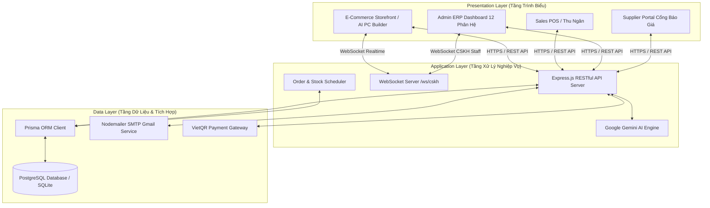
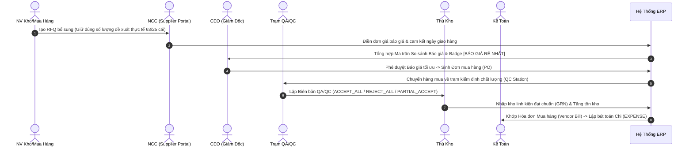
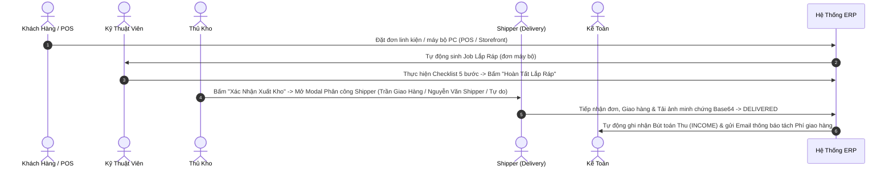

# XÂY DỰNG VÀ TRIỂN KHAI HỆ THỐNG ERP CHO DOANH NGHIỆP BÁN LẺ & LẮP RÁP LINH KIỆN MÁY TÍNH AETHERPC

> **Khóa Luận Tốt Nghiệp Đại Học — Trường Đại Học Công Nghiệp TP. Hồ Chí Minh (IUH)**  
> **Chuyên Ngành**: Hệ Thống Thông Tin — Khoa Công Nghệ Thông Tin  
> **Tên Đề Tài**: XÂY DỰNG VÀ TRIỂN KHAI HỆ THỐNG ERP CHO DOANH NGHIỆP BÁN LẺ & LẮP RÁP LINH KIỆN MÁY TÍNH AETHERPC.

---

## MỤC LỤC

1. [ Tổng Quan Hệ Thống & Bối Cảnh Đề Tài](#1-tổng-quan-hệ-thống--bối-cảnh-đề-tài)
2. [ Kiến Trúc Hệ Thống & Sơ Đồ Khối (System Architecture)](#2-kiến-trúc-hệ-thống--sơ-đồ-khối-system-architecture)
3. [ Danh Sách 15 Nhà Cung Cấp Đối Tác & 14 Vai Trò (RBAC Matrix)](#3-danh-sách-15-nhà-cung-cấp-đối-tác--14-vai-trò-rbac-matrix)
4. [ Quy Trình Vận Hành Chi Tiết (P2P, O2C, QA/QC, Realtime CSKH)](#4-quy-trình-vận-hành-chi-tiết-p2p-o2c-qaqc-realtime-cskh)
5. [ Phân Tích Tính Năng Chi Tiết 12 Phân Hệ ERP Admin & 12 Phân Hệ Storefront](#5-phân-tích-tính-năng-chi-tiết-12-phân-hệ-erp-admin--12-phân-hệ-storefront)
6. [ Thuật Toán & Công Thức Toán Học Trong Hệ Thống](#6-thuật-toán--công-thức-toán-học-trong-hệ-thống)
7. [ Danh Mục RESTful APIs & WebSocket Protocol](#7-danh-mục-restful-apis--websocket-protocol)
8. [ Bộ Kịch Bản Kiểm Thử Chi Tiết (Comprehensive Test Suite)](#8-bộ-kịch-bản-kiểm-thử-chi-tiết-comprehensive-test-suite)
9. [ Công Nghệ Sử Dụng (Tech Stack)](#9-công-nghệ-sử-dụng-tech-stack)
10. [ Cấu Trúc Thư Mục Dự Án Toàn Diện](#10-cấu-trúc-thư-mục-dự-án-toàn-diện)
11. [ Hướng Dẫn Khởi Chạy & Triển Khai (Deployment Guide)](#11-hướng-dẫn-khởi-chạy--triển-khai-deployment-guide)
12. [ Danh Sách Tài Khoản Demo Hệ Thống](#12-danh-sách-tài-khoản-demo-hệ-thống)

---

## 1. Tổng Quan Hệ Thống & Bối Cảnh Đề Tài

Thị trường kinh doanh linh kiện máy tính và lắp ráp PC theo yêu cầu (Custom PC / Gaming Workstation) đòi hỏi khả năng xử lý dữ liệu vô cùng phức tạp: hàng ngàn mã sản phẩm (SKU) với thông số kỹ thuật đa dạng (Socket CPU, Bus RAM, Form Factor Mainboard, Công suất TDP), biến động giá liên tục từ 15 Nhà cung cấp đối tác, cùng các dịch vụ giá trị gia tăng như kiểm định chất lượng QA/QC, lắp ráp kỹ thuật, phân công giao hàng và chăm sóc khách hàng.

**AetherPC ERP** được nghiên cứu và phát triển nhằm giải quyết triệt để các thách thức trên thông qua một **Hệ thống ERP Hợp nhất (Unified Enterprise Resource Planning)**, kết nối trực tiếp **Website Thương mại Điện tử (E-Commerce Storefront)**, **Trợ lý AI Tự động hóa (Google Gemini AI SDK)**, **Phân hệ Kiểm định QA/QC Mới**, **Quy trình Xuất Kho & Phân Công Shipper Mới** và **Kênh Chat CSKH Realtime (WebSocket Server)**.

### Các Mục Tiêu Cốt Lõi:
1. **Tự động hóa luồng Procure-to-Pay (P2P)**: Đánh giá và chọn báo giá Nhà cung cấp tối ưu nhất bằng Thuật toán Ma trận Giá ($P_{\text{save}}$), khởi tạo RFQ giữ nguyên 100% số lượng đề xuất thực tế từ Thủ Kho (ví dụ: 63 cái, 25 cái).
2. **Kiểm định chất lượng chuyên sâu (QA/QC Station)**: Tiếp nhận lô hàng từ Nhà cung cấp, kiểm tra theo tỷ lệ lấy mẫu ($100\%, 50\%, 10\%$), phân loại linh kiện đạt chuẩn và hàng lỗi nhà sản xuất (DOA, hỏng vỏ hộp, sai SKU), phát hành Biên bản QA/QC điện tử.
3. **Chuẩn hóa luồng Order-to-Cash (O2C) & Phân công Shipper Mới**: Tích hợp bán lẻ POS tại quầy, quy trình lắp ráp PC 5 bước kỹ thuật, xuất kho bật modal Phân công Shipper trực tiếp (**Shipper 1 — Trần Giao Hàng**, **Shipper 2 — Nguyễn Văn Shipper**, **Giao Hàng Tự Do**) và giao hàng có minh chứng thực tế (Base64 Proof of Delivery).
4. **Chăm sóc khách hàng Realtime**: Xây dựng server WebSocket hai chiều hai kênh ($< 1\text{ms}$), mẫu câu trả lời nhanh, xóa phiên chat cũ, phân định lịch sử trò chuyện độc lập theo từng tài khoản (`session_user_<slug>`).
5. **Quản trị Tài chính & Nhân sự**: Tính lương tự động theo quy chuẩn 26 ngày công Việt Nam, khấu trừ $10.5\%$ bảo hiểm bắt buộc ($8\%$ BHXH, $1.5\%$ BHYT, $1\%$ BHTN), cộng thưởng Sales $1\%$ và thưởng lắp ráp $150k$/máy, hạch toán Sổ Nhật ký Tài chính VAS.

---

## 2. Kiến Trúc Hệ Thống & Sơ Đồ Khối (System Architecture)



---

## 3. Danh Sách 15 Nhà Cung Cấp Đối Tác & 14 Vai Trò (RBAC Matrix)

### 3.1. Danh Sách 15 Nhà Cung Cấp Linh Kiện PC Đối Tác
Hệ thống kết nối và quản lý danh mục báo giá chính thức từ 15 Nhà cung cấp hàng đầu:

| STT | Mã NCC | Tên Nhà Cung Cấp Báo Giá | Nhóm Linh Kiện Cung Cấp Chính |
| :---: | :--- | :--- | :--- |
| 1 | `SUP-FPT` | Synnex FPT Corporation | CPU, VGA, Mainboard, Laptop |
| 2 | `SUP-VIENSON` | Công ty Cổ phần Máy tính Viễn Sơn | Mainboard, VGA ASUS, SSD |
| 3 | `SUP-MAIHOANG` | Mai Hoàng Distribution | Nguồn PSU, Case, Tản nhiệt, Bàn phím |
| 4 | `SUP-THUYLINH` | Thủy Linh Distribution (TLC) | Mainboard GIGABYTE, RAM, SSD |
| 5 | `SUP-KTC` | Công ty Tin học Kha Thiên (KTC) | Linh kiện tổng hợp, Màn hình |
| 6 | `SUP-ANHNGOC` | Anh Ngọc Distribution | Linh kiện PC, Thiết bị mạng |
| 7 | `SUP-INTEL-VN` | Intel Việt Nam | Vi xử lý Intel Core i3 / i5 / i7 / i9 |
| 8 | `SUP-AMD-VN` | AMD Việt Nam | Vi xử lý AMD Ryzen 5 / 7 / 9, Radeon VGA |
| 9 | `SUP-ASUS-VN` | ASUS Việt Nam | Mainboard ROG/TUF, VGA, Màn hình |
| 10 | `SUP-MSI-VN` | MSI Việt Nam | Mainboard Gaming, Card đồ họa MSI |
| 11 | `SUP-SAMSUNG-VN`| Samsung Vina Electronics | Ổ cứng SSD NVMe M.2, RAM, Màn hình |
| 12 | `SUP-LG-VN` | LG Electronics Việt Nam | Màn hình đồ họa / Gaming UltraGear |
| 13 | `SUP-GIGABYTE-VN`| GIGABYTE Việt Nam | Card đồ họa Eagle/AORUS, Mainboard |
| 14 | `SUP-CORSAIR-VN`| Corsair Việt Nam | RAM Vengeance, Nguồn PSU, Tản nhiệt AIO |
| 15 | `SUP-KINGSTON-VN`| Kingston Technology Việt Nam | RAM Fury Beast, SSD NV2 / KC3000 |

---

### 3.2. Ma Trận Phân Quyền Vai Trò (RBAC Matrix)

| STT | Mã Vai Trò (Role) | Chức Danh Phân Nhiệm | Mô Tả Quyền Hạn & Chức Năng Chi Tiết |
| :---: | :--- | :--- | :--- |
| 1 | `ceo` | Giám Đốc Điều Hành (CEO) | Xem Executive Dashboard realtime, duyệt báo giá Mua hàng PO, duyệt giải ngân Bảng lương hàng tháng. |
| 2 | `admin` | Quản Trị Hệ Thống | Cấu hình hệ thống, quản lý tài khoản người dùng, xem nhật ký truy cập Audit Logs, cấp lại mật khẩu. |
| 3 | `sales_manager` | Quản Lý Bán Hàng | Quản lý danh mục đơn hàng bán lẻ POS & E-Commerce, duyệt hủy đơn, xem phân tích biểu đồ doanh số. |
| 4 | `sales` | Nhân Viên Bán Hàng POS | Bán hàng tại quầy, tìm kiếm/quét mã vạch sản phẩm, in hóa đơn thu ngân, nhận thanh toán VietQR. |
| 5 | `warehouse_manager`| Quản Lý Kho Bãi | Quản lý 1.580 linh kiện PC, kiểm kê tồn kho, thiết lập ngưỡng an toàn (Safe/Warning/Out of stock). |
| 6 | `warehouse` | Thủ Kho | Tạo Phiếu nhập kho (GRN) từ PO mua hàng, xuất kho mở modal phân công Shipper trực tiếp. |
| 7 | `purchasing` | Nhân Viên Mua Hàng | Khởi tạo Yêu cầu Báo giá (RFQ) gửi 15 NCC, giữ đúng số lượng đề xuất thực tế, sinh đơn PO. |
| 8 | `supplier` | Cổng Nhà Cung Cấp | Truy cập Supplier Portal tiếp nhận RFQ từ AetherPC, nhập đơn giá và cam kết ngày giao hàng. |
| 9 | `qc` / `qa` | Kiểm Định Chất Lượng (Mới)| Kiểm tra chất lượng linh kiện mua về, lập Biên bản QA/QC, phân loại hàng lỗi DOA trước khi nhập kho. |
| 10 | `assembly` | Kỹ Thuật Viên Lắp Ráp | Nhận Job lắp ráp PC bộ, thực hiện Quy trình Checklist 5 bước kỹ thuật (Socket, Tản nhiệt, Đi dây, BIOS, Stress Test). |
| 11 | `hr` | Quản Lý Nhân Sự | Quản lý hồ sơ nhân viên, tính bảng lương 26 ngày công (Khấu trừ $10.5\%$ bảo hiểm, thưởng Sales $1\%$, thưởng lắp ráp $150k$). |
| 12 | `accounting` | Kế Toán Tài Chính | Quản lý Sổ Nhật ký Tài chính VAS (`INCOME`/`EXPENSE`), kiểm tra hóa đơn NCC (Vendor Bill), báo cáo P&L. |
| 13 | `cskh` | Chăm Sóc Khách Hàng | Quản lý Ticket bảo hành, Live Chat WebSocket thời gian thực ($<1\text{ms}$), mẫu câu phản hồi nhanh, xóa phiên chat cũ. |
| 14 | `delivery` | Nhân Viên Giao Hàng (Mới)| Nhận đơn sẵn sàng giao, chụp ảnh minh chứng thực tế (Base64) khi giao thành công, ghi nhận 6 lý do thất bại. |

---

## 4. Quy Trình Vận Hành Chi Tiết (Workflow Processes)

### 4.1. Quy Trình Mua Hàng, Báo Giá & Kiểm Định QA/QC (P2P — Procure-to-Pay)



---

### 4.2. Quy Trình Bán Hàng, Phân Công Shipper Mới & Giao Hàng (O2C — Order-to-Cash)



---

## 5. Phân Tích Tính Năng Chi Tiết 12 Phân Hệ ERP Admin & 12 Phân Hệ Storefront

### 5.1. Các Phân Hệ ERP Admin (`/admin/*`)

1. **Executive Dashboard (`Dashboard.jsx`)**:
   - KPIs doanh số thời gian thực, rã doanh thu POS vs Storefront.
   - Biểu đồ phân bổ cơ cấu linh kiện bán ra.
   - Banner thông báo CEO duyệt báo giá Mua hàng thiết kế trên tông màu sáng ấm (`#fffbeb → #fef3c7`).
   - Drilldown Modal xem danh sách chi tiết đơn hàng đóng góp khi click thẻ KPI.

2. **Sales POS Thu Ngân (`SalesPOS.jsx`)**:
   - Tìm kiếm linh kiện theo Tên/SKU, quét mã vạch Barcode scanner.
   - Thanh toán chuyển khoản QR Code VietQR tự động.
   - In hóa đơn bán lẻ tại quầy.

3. **Quản Lý Kho Bãi (`Warehouse.jsx`)**:
   - Quản lý 1.580 linh kiện PC theo 3 ngưỡng rủi ro (`SAFE`, `WARNING`, `OUT_OF_STOCK`).
   - Xem nhật ký biến động xuất nhập kho (Stock Movement Audit Logs) và modal chi tiết giao dịch.
   - Xem lịch sử gửi cảnh báo Yêu cầu Báo giá (RFQ Alert History Modal).
   - **Xác Nhận Xuất Kho & Phân Công Shipper Mới**: Nhấn "Xác Nhận Xuất Kho" trong chi tiết đơn hàng sẽ tự động mở modal Phân công Shipper (**Shipper 1 — Trần Giao Hàng**, **Shipper 2 — Nguyễn Văn Shipper**, **Giao Hàng Tự Do**). Tự động đóng cả 2 modal và phát thông báo Realtime tới bộ phận Giao Hàng & Bán Hàng.

4. **Mua Hàng & RFQ (`Purchasing.jsx`)**:
   - Ma trận so sánh báo giá đa NCC từ 15 Nhà cung cấp đối tác với thuật toán tiết kiệm $P_{\text{save}}$.
   - **Đồng bộ đúng số lượng đề xuất**: Tiếp nhận chuẩn xác 100% số lượng đề xuất từ Kho (ví dụ: 63 cái, 25 cái) khi mở form khởi tạo RFQ.

5. **Kiểm Định Chất Lượng QA/QC Mới (`QualityControl.jsx`)**:
   - Trạm kiểm định linh kiện nhập kho từ Nhà cung cấp.
   - 3 Quyết định kiểm định: `ACCEPT_ALL` (Nhập toàn bộ), `REJECT_ALL` (Từ chối trả hàng), `PARTIAL_ACCEPT` (Nhập một phần).
   - 5 Phân loại lỗi: `PACKAGE_DAMAGED` (Vỡ móp vỏ hộp), `HARDWARE_DEFECT` (Lỗi linh kiện), `MISSING_ACCESSORY` (Thiếu phụ kiện), `WRONG_SPEC` (Sai SKU), `DOA` (Lỗi bật không lên).
   - Tỷ lệ lấy mẫu: `100%`, `50%`, `10%`. Phát hành Biên bản Kiểm định QA/QC điện tử.

6. **Quản Lý Lắp Ráp PC (`Assembly.jsx`)**:
   - Tự động sinh Job lắp ráp máy bộ PC.
   - Quy trình Checklist 5 bước kỹ thuật (Socket CPU, Keo tản nhiệt, Cable Management, BIOS, Stress Test).
   - Cộng thưởng $150.000$đ/máy vào bảng lương kỹ thuật viên.

7. **Quản Lý Nhân Sự & Bảng Lương (`HRManager.jsx` & `MyPayroll.jsx`)**:
   - Tính lương theo quy chuẩn 26 ngày công Việt Nam.
   - Khấu trừ $10.5\%$ bảo hiểm bắt buộc ($8\%$ BHXH, $1.5\%$ BHYT, $1\%$ BHTN).
   - Thưởng Sales $1\%$ + Thưởng Lắp ráp PC $150k$/máy.
   - Cổng MyPayroll Portal cho nhân viên tra cứu phiếu lương cá nhân.

8. **Kế Toán Tài Chính (`Accountant.jsx`)**:
   - Sổ Nhật ký Tài chính VAS (`INCOME`/`EXPENSE`).
   - Khớp hóa đơn mua hàng Vendor Bill 3 bên (PO - GRN - Bill).
   - Báo cáo P&L (Profit & Loss).

9. **Giao Hàng & Logistics Mới (`Delivery.jsx`)**:
   - Tiếp nhận đơn hàng phân công từ Kho (`READY_TO_SHIP`).
   - Chụp/tải ảnh minh chứng giao hàng thực tế Base64 kèm ghi chú người nhận.
   - Ghi nhận 6 lý do giao thất bại (Khách không nghe máy, hẹn lại ngày, hủy đơn, không tìm thấy địa chỉ, sai COD, hỏng do vận chuyển).

10. **Chăm Sóc Khách Hàng Realtime (`CustomerService.jsx`)**:
    - Live Chat 1-1 Realtime qua WebSocket Server `ws://localhost:5000/ws/cskh` ($< 1\text{ms}$).
    - Mẫu câu phản hồi nhanh, quản lý phiên chat theo tài khoản (`session_user_<slug>`).
    - Nút xóa phiên chat cũ (`🗑️ Xóa phiên chat này`).
    - Quản lý Ticket bảo hành & duyệt đơn Đổi trả linh kiện.

11. **Quản Trị Hệ Thống (`SystemAdmin.jsx`)**:
    - Quản lý tài khoản 14 nhóm quyền RBAC Matrix, xem Audit Logs.

12. **Cổng Nhà Cung Cấp (`SupplierPortal/index.jsx`)**:
    - Cổng kết nối 15 Nhà cung cấp đối tác tiếp nhận RFQ và báo giá trực tuyến.

---

### 5.2. Các Phân Hệ Storefront & E-Commerce (`/*`)

1. **Trang Chủ Storefront (`Home.jsx`)**: Banner khuyến mãi, danh mục linh kiện bán chạy.
2. **Bộ Công Cụ Tự Build PC (`PCBuilder.jsx`)**:
   - Tự chọn cấu hình PC chuyên nghiệp.
   - AI kiểm tra xung đột Socket CPU/Mainboard & chuẩn RAM DDR4/DDR5.
   - Tính toán công suất nguồn PSU khuyến nghị ($\le 80\%$ TDP).
3. **Chi Tiết Sản Phẩm (`ProductDetail.jsx`)**: Thông số kỹ thuật chi tiết & kiểm tra tồn kho.
4. **Giỏ Hàng & Thanh Toán (`Cart.jsx`)**:
   - Tách biệt chi tiết **Tạm tính linh kiện**, **Phí giao hàng / Vận chuyển (`+30.000 đ` hoặc `MIỄN PHÍ`)**, và **Tổng thanh toán**.
   - Thanh toán VietQR Code tự động.
5. **Theo Dõi Đơn Hàng (`MyOrders.jsx`)**: Tra cứu hành trình vận đơn Realtime, xem ảnh minh chứng giao hàng thực tế.
6. **Flash Sale (`FlashSale.jsx`)**: Sản phẩm giảm giá theo khung giờ.
7. **Member Tier Loyalty (`MemberTier.jsx`)**: Tích điểm thưởng & đặc quyền hạng thành viên.
8. **Promotions (`Promotions.jsx`)**: Mã giảm giá & voucher.
9. **News & NewsDetail (`News.jsx`)**: Tin tức phần cứng & hướng dẫn công nghệ.
10. **About & Careers (`About.jsx`, `Careers.jsx`)**: Giới thiệu công ty & Tuyển dụng.
11. **Trợ Lý Chatbot AI Antigravity**: Google Gemini AI SDK tư vấn cấu hình PC 24/7.

---

## 6. Thuật Toán & Công Thức Toán Học Trong Hệ Thống

### 6.1. Thuật Toán So Sánh Báo Giá Nhà Cung Cấp ($P_{\text{save}}$)
Cho tập hợp các báo giá $T = \{T_1, T_2, \dots, T_n\}$ gửi từ 15 Nhà cung cấp cho cùng một yêu cầu RFQ:
$$T_{\min} = \min(T), \quad T_{\max} = \max(T)$$
Tỷ lệ chi phí tiết kiệm được khi phê duyệt phương án rẻ nhất được tính theo công thức:
$$P_{\text{save}} = \left( \frac{T_{\max} - T_{\min}}{T_{\max}} \right) \times 100\%$$

### 6.2. Công Thức Tính Bảng Lương Hàng Tháng (Payroll Model)
Lương thực nhận ($L_{\text{net}}$) của nhân viên trong tháng được xác định theo quy chuẩn 26 ngày công:
$$L_{\text{gross}} = \left( L_{\text{cơ bản}} \times \frac{D_{\text{công}}}{26} \right) + K_{\text{sales}} \cdot 1\% + N_{\text{lắp ráp}} \cdot 150.000\text{đ}$$
$$L_{\text{khấu trừ}} = L_{\text{gross}} \times 10.5\% \quad (8\% \text{ BHXH} + 1.5\% \text{ BHYT} + 1\% \text{ BHTN})$$
$$L_{\text{net}} = L_{\text{gross}} - L_{\text{khấu trừ}}$$

### 6.3. Thuật Toán Kiểm Tra Công Suất Nguồn PSU Khi Build PC
Để hệ thống máy tính hoạt động bền bỉ, tổng điện năng tiêu thụ (TDP) của tất cả linh kiện không được vượt quá $80\%$ công suất danh định của Nguồn PSU:
$$P_{\text{tổng TDP}} = \text{TDP}_{\text{CPU}} + \text{TDP}_{\text{GPU}} + \text{TDP}_{\text{Mainboard}} + \text{TDP}_{\text{Khác}}$$
$$P_{\text{PSU khuyến nghị}} \ge \frac{P_{\text{tổng TDP}}}{0.80}$$

---

## 7. Danh Mục RESTful APIs & WebSocket Protocol

### 7.1. RESTful APIs Endpoints (Base URL: `http://localhost:5000/api/v1`)

| Phân Hệ | Phương Thức | Endpoint | Mô Tả Chức Năng |
| :--- | :---: | :--- | :--- |
| **Auth** | `POST` | `/auth/login` | Đăng nhập tài khoản Khách hàng / Nhân viên / NCC |
| **Auth** | `GET` | `/auth/me` | Lấy thông tin tài khoản hiện tại từ JWT Token |
| **Products** | `GET` | `/products` | Lấy danh sách linh kiện PC kèm bộ lọc/tìm kiếm |
| **Orders** | `POST` | `/orders` | Tạo đơn hàng mới (POS / Storefront) |
| **Orders** | `PATCH` | `/orders/:id/delivery-proof` | Tải ảnh minh chứng giao hàng & cập nhật trạng thái |
| **Purchasing**| `POST` | `/purchasing/rfq` | Khởi tạo Yêu cầu Báo giá (RFQ) tới 15 NCC |
| **Purchasing**| `GET` | `/purchasing/matrix` | Lấy Ma trận So sánh Báo giá Nhà cung cấp |
| **QC/QA** | `POST` | `/qc/inspect` | Tạo biên bản kiểm định chất lượng linh kiện nhập kho |
| **HR** | `GET` | `/hr/payroll` | Tự động tính toán Bảng lương hàng tháng |
| **Chat CSKH** | `GET` | `/chat/cskh/sessions` | Lấy danh sách phiên chat tư vấn CSKH |

### 7.2. Giao Thức WebSocket Realtime (`ws://localhost:5000/ws/cskh`)

| Tên Sự Kiện (Type) | Chi Chiều Gửi | Payload Cấu Trúc | Mô Tả Tác Vụ |
| :--- | :---: | :--- | :--- |
| `INIT_SESSIONS` | Server $\rightarrow$ Client | `{ sessions: Array }` | Gửi toàn bộ dữ liệu các phiên chat khi mới kết nối |
| `CUSTOMER_SEND_MSG` | Customer $\rightarrow$ Server | `{ sessionId, text, customerName }` | Khách hàng gửi tin nhắn mới tới Server |
| `STAFF_SEND_MSG` | Staff $\rightarrow$ Server | `{ sessionId, text }` | NV CSKH phản hồi tin nhắn cho khách hàng |
| `UPDATE_SESSIONS` | Server $\rightarrow$ All Clients | `{ sessions: Array, newMsg }` | Phát thông điệp cập nhật tin nhắn tức thì ($< 1\text{ms}$) |
| `DELETE_SESSION` | Staff $\rightarrow$ Server | `{ sessionId }` | Xóa hoàn toàn 1 phiên chat cũ khỏi Server |

---

## 8. Bộ Kịch Bản Kiểm Thử Chi Tiết (Comprehensive Test Suite)

### 8.1. Executive Dashboard (`TC-DASH`)
- **`TC-DASH-01`**: Lọc dữ liệu KPI theo khoảng thời gian `Từ ngày — Đến ngày`. Doanh thu và đơn hàng tự động cập nhật chuẩn xác.
- **`TC-DASH-02`**: Click thẻ KPI mở Drilldown Modal xem danh sách đơn hàng đóng góp.

### 8.2. Sales POS Thu Ngân (`TC-POS`)
- **`TC-POS-01`**: Lập đơn bán lẻ tại quầy, tạo mã QR VietQR, hoàn tất thanh toán và trừ tồn kho tự động.

### 8.3. Quản Lý Kho (`TC-WH`)
- **`TC-WH-01`**: Lọc nhật ký biến động kho IN/OUT theo khoảng thời gian.
- **`TC-WH-02`**: Nhấn "Xác Nhận Xuất Kho" trong chi tiết đơn hàng -> Bật modal chọn Shipper (Shipper 1, Shipper 2, Tự do) -> Tự động đóng cả 2 modal và phát thông báo Realtime.

### 8.4. Mua Hàng & RFQ (`TC-PUR`)
- **`TC-PUR-01`**: Tạo RFQ gửi 15 NCC cho sản phẩm cảnh báo kho -> Tự động giữ nguyên số lượng đề xuất thực tế (ví dụ: 63 cái, 25 cái).
- **`TC-PUR-02`**: Phê duyệt báo giá rẻ nhất qua Ma Trận Giá $P_{\text{save}}$ -> Chuyển thành PO chính thức.

### 8.5. Kiểm Định Chất Lượng QA/QC Mới (`TC-QC`)
- **`TC-QC-01`**: Tiếp nhận lô hàng mua về trạm QC -> Chọn tỷ lệ kiểm tra ($100\%, 50\%, 10\%$) -> Phát hành biên bản QA/QC cho phép nhập kho.

### 8.6. Phân Công Shipper & Giao Hàng Mới (`TC-DEL`)
- **`TC-DEL-01`**: Tiếp nhận đơn xuất kho đã phân công Shipper -> Chụp/tải ảnh minh chứng giao hàng Base64 -> Cập nhật trạng thái `DELIVERED`.

### 8.7. Chăm Sóc Khách Hàng WebSocket (`TC-CSKH`)
- **`TC-CSKH-01`**: Chat 1-1 giữa Khách hàng và Nhân viên CSKH qua WebSocket -> Tin nhắn nhận tức thì $< 1\text{ms}$.
- **`TC-CSKH-02`**: Nhấn `🗑️ Xóa phiên chat này` -> Phiên chat bị xóa sạch khỏi Server và danh sách Admin.

---

## 9. Công Nghệ Sử Dụng (Tech Stack)

### Frontend
- **Core Framework**: React.js (v18) xây dựng trên nền Vite bundling tool.
- **Styling**: Vanilla CSS Custom Variables, thiết kế Glassmorphic UI cao cấp, font chữ **Inter**.
- **Realtime Sync**: WebSocket Client & Inter-tab BroadcastChannel API.
- **Icons & UI**: Lucide React Icons, Chart.js / React-Chartjs-2.
- **State Management**: `ERPContext`, `CartContext`, `AuthContext`.

### Backend
- **Framework**: Node.js & Express.js RESTful API.
- **Realtime Engine**: WebSocket Server (`ws` library) khởi chạy trên `ws://localhost:5000/ws/cskh`.
- **Database & ORM**: PostgreSQL v15 & Prisma ORM.
- **Security & Auth**: JSON Web Token (JWT) & bcryptjs password hashing.
- **AI Integration**: Google Generative AI SDK (`@google/generative-ai` - Gemini 1.5 Flash).
- **Email Notification**: Nodemailer Service tích hợp Gmail App Password (CSS chống lóa Gmail Dark Mode).

### Deployment & Tools
- **Docker Compose**: Containerization trọn gói Frontend, Backend và PostgreSQL Database.
- **Data Generator**: Script Python cào và chuẩn hóa 1.580 dữ liệu linh kiện PC thực tế.

---

## 10. Cấu Trúc Thư Mục Dự Án Toàn Diện

```
ERP_AetherPC/
├── backend/                  # Server Node.js (Express + Prisma ORM + WebSocket Server + Gmail SMTP)
│   ├── prisma/               # Schema cơ sở dữ liệu Prisma & Seed migration
│   ├── src/
│   │   ├── config/           # Cấu hình JWT, Database & Nodemailer SMTP
│   │   ├── controllers/      # Bộ xử lý nghiệp vụ Order, Purchasing, HR, ERP, Chat CSKH, Quality Control
│   │   ├── middlewares/      # Phân quyền RBAC, AuthToken JWT validation
│   │   ├── routes/           # REST API endpoints (Orders, Purchasing, Delivery, Chat CSKH, QC)
│   │   └── services/         # WebSocket Service (ws/cskh), Email service (Gmail SMTP)
│   ├── .env.example          # Tệp cấu hình môi trường mẫu cho Backend
│   └── Dockerfile            # Cấu hình Docker build Backend
├── frontend/                 # Client Single Page Application (React + Vite + Lucide)
│   ├── src/
│   │   ├── components/       # UI Components tái sử dụng (Layout, Modals, Chatbot AI/CSKH)
│   │   ├── config/           # Cấu hình danh sách 15 Nhà Cung Cấp đối tác
│   │   ├── context/          # React Context State (AuthContext, CartContext, ERPContext)
│   │   ├── pages/            # Các trang phân hệ ERP & Storefront
│   │   │   ├── Admin/        # 12 Phân hệ Quản trị ERP (SalesPOS, Purchasing, Warehouse, QualityControl...)
│   │   │   ├── Storefront/   # 12 Trang cửa hàng Online & AI PC Builder
│   │   │   └── SupplierPortal/ # Cổng tương tác báo giá cho 15 Nhà Cung Cấp
│   │   └── services/         # Axios/Fetch API Client & helper utilities
│   ├── .env.example          # Tệp cấu hình môi trường mẫu cho Frontend
│   └── Dockerfile            # Cấu hình Docker build Frontend
├── database/                 # SQL Schema chuẩn & script khởi tạo Seed DB
├── docs/                     # Tài liệu Khóa luận Tốt nghiệp IUH (.docx) & Sơ đồ UML/BPMN
├── scraper/                  # Python Scraper cào & làm sạch 1.580 linh kiện PC thực tế
├── scripts/                  # Scripts hỗ trợ xuất báo cáo luận văn IUH
└── docker-compose.yml        # Cấu hình containerization trọn gói (Frontend, Backend, Postgres)
```

---

## 11. Hướng Dẫn Khởi Chạy & Triển Khai (Deployment Guide)

### Cách 1: Khởi Chạy Bằng Docker Compose (Khuyên dùng)

1. **Khởi tạo tệp môi trường từ bản mẫu**:
   ```bash
   cp backend/.env.example backend/.env
   cp frontend/.env.example frontend/.env
   ```

2. **Chạy Docker Compose**:
   ```bash
   docker-compose up --build -d
   ```

3. **Truy cập ứng dụng**:
   - **Storefront & Admin ERP**: `http://localhost:3000`
   - **Backend REST API**: `http://localhost:5000`
   - **WebSocket Realtime CSKH**: `ws://localhost:5000/ws/cskh`

---

### Cách 2: Khởi Chạy Thủ Công (Development Mode)

1. **Backend Server**:
   ```bash
   cd backend
   npm install
   npm run dev
   ```

2. **Frontend SPA Application**:
   ```bash
   cd frontend
   npm install
   npm run dev
   ```

---

## 12. Danh Sách 14 Tài Khoản Demo Hệ Thống

Đăng nhập tại trang `/login` bằng các tài khoản demo (Mật khẩu mặc định: `123456`):

| STT | Vai Trò (Role) | Chức Danh Phân Nhiệm | Username | Mật khẩu mẫu |
| :---: | :--- | :--- | :--- | :--- |
| 1 | `ceo` | Giám Đốc Điều Hành (CEO) | `ceo` | `123456` |
| 2 | `admin` | Quản Trị Hệ Thống | `admin` | `123456` |
| 3 | `sales_manager` | Quản Lý Bán Hàng | `sales_manager` | `123456` |
| 4 | `sales` | Nhân Viên Bán Hàng POS | `sales` | `123456` |
| 5 | `warehouse_manager`| Quản Lý Kho Bãi | `warehouse_manager` | `123456` |
| 6 | `warehouse` | Thủ Kho | `warehouse` | `123456` |
| 7 | `purchasing` | Nhân Viên Mua Hàng | `purchasing` | `123456` |
| 8 | `supplier` | Cổng 15 Nhà Cung Cấp Đối Tác | `supplier` | `123456` |
| 9 | `qc` / `qa` | Kiểm Định Chất Lượng (Mới) | `qc` | `123456` |
| 10 | `assembly` | Kỹ Thuật Lắp Ráp PC | `assembly` | `123456` |
| 11 | `hr` | Quản Lý Nhân Sự | `hr` | `123456` |
| 12 | `accounting` | Kế Toán Tài Chính | `accounting` | `123456` |
| 13 | `cskh` | Chăm Sóc Khách Hàng | `cskh` | `123456` |
| 14 | `delivery` | Nhân Viên Giao Hàng | `delivery` | `123456` |

---

## Báo Cáo Khóa Luận Tốt Nghiệp (.docx)

Tài liệu báo cáo chính thức lưu trữ tại:  
`docs/Bao_Cao_Khoa_Luan_Tot_Nghiep_IUH_AetherPC_ERP.docx`

---

## Bản Quyền & Giấy Phép
Dự án hoàn thiện phục vụ Khóa luận Tốt nghiệp Đại học chuyên ngành Hệ thống Thông tin — Khoa Công nghệ Thông tin — Trường Đại học Công nghiệp TP. Hồ Chí Minh (IUH). Tất cả quyền được bảo lưu © 2026.
