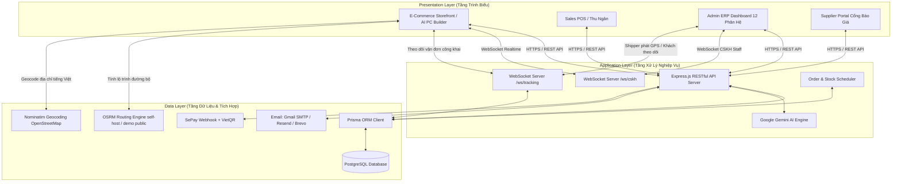
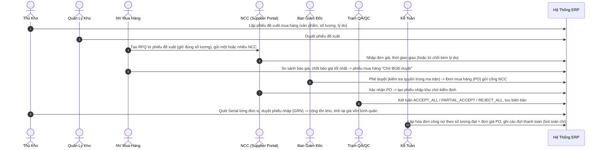

# XÂY DỰNG VÀ TRIỂN KHAI HỆ THỐNG ERP CHO DOANH NGHIỆP AETHERPC

> **Khóa Luận Tốt Nghiệp Đại Học — Trường Đại Học Công Nghiệp TP. Hồ Chí Minh (IUH)**  
> **Chuyên Ngành**: Hệ Thống Thông Tin — Khoa Công Nghệ Thông Tin  
> **Tên Đề Tài**: Xây dựng và triển khai hệ thống ERP cho doanh nghiệp (**AetherPC ERP & Storefront**).  
> **Nhóm thực hiện**: Nguyễn Hoàng Mỹ, Võ Thanh Sang — **GVHD**: ThS. Trần Thị Kim Chi  
> **Báo cáo khóa luận**: [`docs/bao_cao/AetherPC_KLTN.docx`](docs/bao_cao/AetherPC_KLTN.docx) · [`AetherPC_KLTN.pdf`](docs/bao_cao/AetherPC_KLTN.pdf)

---

## MỤC LỤC

1. [Tổng Quan Hệ Thống & Bối Cảnh Đề Tài](#1-tổng-quan-hệ-thống--bối-cảnh-đề-tài)
2. [Kiến Trúc Hệ Thống & Sơ Đồ Khối (System Architecture)](#2-kiến-trúc-hệ-thống--sơ-đồ-khối-system-architecture)
3. [Danh Sách 15 Nhà Cung Cấp Đối Tác & 14 Vai Trò Nội Bộ (RBAC Matrix)](#3-danh-sách-15-nhà-cung-cấp-đối-tác--14-vai-trò-nội-bộ-rbac-matrix)
4. [Quy Trình Vận Hành Chi Tiết (Workflow Processes)](#4-quy-trình-vận-hành-chi-tiết-workflow-processes)
5. [Phân Tích Tính Năng Chi Tiết 12 Phân Hệ ERP Admin & 12 Phân Hệ Storefront](#5-phân-tích-tính-năng-chi-tiết-12-phân-hệ-erp-admin--12-phân-hệ-storefront)
6. [Thuật Toán & Công Thức Toán Học Trong Hệ Thống](#6-thuật-toán--công-thức-toán-học-trong-hệ-thống)
7. [Danh Mục RESTful APIs & WebSocket Protocol](#7-danh-mục-restful-apis--websocket-protocol)
8. [Bộ Kịch Bản Kiểm Thử Chi Tiết (Comprehensive Test Suite)](#8-bộ-kịch-bản-kiểm-thử-chi-tiết-comprehensive-test-suite)
9. [Công Nghệ Sử Dụng (Tech Stack)](#9-công-nghệ-sử-dụng-tech-stack)
10. [Cấu Trúc Thư Mục Dự Án Toàn Diện](#10-cấu-trúc-thư-mục-dự-án-toàn-diện)
11. [Hướng Dẫn Khởi Chạy & Triển Khai (Deployment Guide)](#11-hướng-dẫn-khởi-chạy--triển-khai-deployment-guide)
12. [Danh Sách Tài Khoản Demo Hệ Thống](#12-danh-sách-tài-khoản-demo-hệ-thống)
    - [12.1. Tài Khoản Shipper Theo Khu Vực](#121-tài-khoản-shipper-theo-khu-vực-5-shipper-nội-bộ-cố-định)

---

## 1. Tổng Quan Hệ Thống & Bối Cảnh Đề Tài

Thị trường kinh doanh linh kiện máy tính và lắp ráp PC theo yêu cầu (Custom PC / Gaming Workstation) đòi hỏi khả năng xử lý dữ liệu vô cùng phức tạp: hàng ngàn mã sản phẩm (SKU) với thông số kỹ thuật đa dạng (Socket CPU, Bus RAM, Form Factor Mainboard, Công suất TDP), biến động giá liên tục từ 15 Nhà cung cấp đối tác, cùng các dịch vụ giá trị gia tăng như kiểm định chất lượng QA/QC, lắp ráp kỹ thuật, phân công giao hàng và chăm sóc khách hàng.

**AetherPC ERP** được nghiên cứu và phát triển nhằm giải quyết triệt để các thách thức trên thông qua một **Hệ thống ERP Hợp nhất (Unified Enterprise Resource Planning)**, kết nối trực tiếp **Website Thương mại Điện tử (E-Commerce Storefront)**, **Trợ lý AI Tự động hóa (Google Gemini AI SDK)**, **Phân hệ Kiểm định QA/QC Mới**, **Quy trình Xuất Kho & Phân Công Shipper Theo Khu Vực** và **Kênh Chat CSKH Realtime (WebSocket Server)**.

### Các Mục Tiêu Cốt Lõi:
1. **Tự động hóa luồng Procure-to-Pay (P2P)**: Đánh giá và chọn báo giá Nhà cung cấp tối ưu nhất bằng Thuật toán Ma trận Giá ($P_{\text{save}}$), khởi tạo RFQ giữ nguyên 100% số lượng đề xuất thực tế từ Thủ Kho (ví dụ: 63 cái, 25 cái).
2. **Kiểm định chất lượng chuyên sâu (QA/QC Station)**: Tiếp nhận lô hàng từ Nhà cung cấp, kiểm tra theo tỷ lệ lấy mẫu ($100\%, 50\%, 10\%$), phân loại linh kiện đạt chuẩn và hàng lỗi nhà sản xuất (DOA, hỏng vỏ hộp, sai SKU), phát hành Biên bản QA/QC điện tử.
3. **Chuẩn hóa luồng Order-to-Cash (O2C) & Phân công Shipper Theo Khu Vực**: Tích hợp bán lẻ POS tại quầy, lệnh lắp ráp PC có danh mục kiểm thử 4 mục bắt buộc (BIOS/POST, cài hệ điều hành, chạy tải nặng, niêm phong) trước khi nghiệm thu, xuất kho bật modal Điều Phối Vận Chuyển — hệ thống tự nhận diện khu vực từ địa chỉ giao hàng và gợi ý shipper nội bộ phù hợp nhất (5 shipper cố định: 4 người phụ trách riêng 4 khu vực TP.HCM + 1 người phụ trách liên tỉnh/toàn quốc), không còn phụ thuộc đối tác vận chuyển ngoài. Đơn được phân công **giữ nguyên trạng thái "Sẵn Sàng Giao" (chờ nhận)** cho đến khi đúng shipper đó tự bấm "Nhận Chuyến" mới chuyển sang "Đang Giao" — không tự động gán ép; giao hàng có minh chứng thực tế (Base64 Proof of Delivery).
4. **Theo Dõi Vận Đơn Trực Tuyến Thời Gian Thực (Live GPS Tracking)**: Lấy cảm hứng từ Grab/Shopee/Xanh SM — Shipper phát toạ độ GPS thiết bị qua kênh WebSocket riêng (`/ws/tracking`, tách khỏi kênh CSKH), hệ thống tính lộ trình đường bộ thực tế qua OSRM (Open Source Routing Machine, có hạ tầng tự host chuẩn bị sẵn trên Railway, mặc định dùng server demo công khai), hiển thị trên bản đồ Leaflet/OpenStreetMap kiểu Google Maps đơn giản. Khách hàng theo dõi công khai không cần đăng nhập tại `/track/:orderId`; lưu vệt di chuyển đầy đủ (`LocationHistory`) phục vụ tra soát khiếu nại.
5. **Chăm sóc khách hàng Realtime**: Xây dựng server WebSocket hai chiều hai kênh, phiên chat lưu trong PostgreSQL, mẫu câu trả lời nhanh, xóa phiên chat cũ, phân định lịch sử trò chuyện độc lập theo từng tài khoản (`session_user_<slug>`).
6. **Thanh toán chuyển khoản tự động qua SePay**: Đơn chuyển khoản sinh mã VietQR kèm nội dung `AETHERPC <mã đơn>`; khi tiền về, SePay gửi webhook có khóa xác thực, hệ thống tự ghi nhận thanh toán, tự duyệt đơn và ghi bút toán thu. Chuyển dư, chuyển thiếu hoặc chuyển vào đơn đã hủy được ghi "Chờ hoàn tiền" để Kế toán xử lý; đơn quá 30 phút chưa thanh toán tự hủy.
7. **Chấm công bằng nhận diện khuôn mặt & tính lương**: Nhân viên chấm công vào/ra ca bằng khuôn mặt (face-api.js chạy trên trình duyệt, kiểm tra người thật bằng thử thách quay đầu, so khớp tại máy chủ). Lương tính theo công chuẩn từng tháng, tăng ca 150/200/300%, bảo hiểm bắt buộc $10.5\%$, thuế TNCN lũy tiến; phiếu lương đi qua quy trình Nhân sự lập → Ban Giám đốc duyệt → Kế toán giải ngân, mỗi lần giải ngân ghi bút toán chi vào sổ cái.

---

## 2. Kiến Trúc Hệ Thống & Sơ Đồ Khối (System Architecture)


```mermaid
graph TD
    subgraph "Presentation Layer (Tầng Trình Biểu)"
        UI1[E-Commerce Storefront / AI PC Builder]
        UI2[Sales POS / Thu Ngân]
        UI3[Admin ERP Dashboard 12 Phân Hệ]
        UI4[Supplier Portal Cổng Báo Giá]
    end

    subgraph "Application Layer (Tầng Xử Lý Nghiệp Vụ)"
        API[Express.js RESTful API Server]
        WSC[WebSocket Server /ws/cskh]
        WST[WebSocket Server /ws/tracking]
        AI[Google Gemini AI Engine]
        SCH[Order & Stock Scheduler]
    end

    subgraph "Data Layer (Tầng Dữ Liệu & Tích Hợp)"
        DB[(PostgreSQL Database)]
        ORM[Prisma ORM Client]
        SMTP[Email: Gmail SMTP / Resend / Brevo]
        QR[SePay Webhook + VietQR]
        OSRM[OSRM Routing Engine self-host / demo public]
        NOM[Nominatim Geocoding OpenStreetMap]
    end

    UI1 <-->|HTTPS / REST API| API
    UI1 <-->|WebSocket Realtime| WSC
    UI1 <-->|Theo dõi vận đơn công khai| WST
    UI2 <-->|HTTPS / REST API| API
    UI3 <-->|HTTPS / REST API| API
    UI3 <-->|WebSocket CSKH Staff| WSC
    UI3 <-->|Shipper phát GPS / Khách theo dõi| WST
    UI4 <-->|HTTPS / REST API| API

    API <--> ORM
    ORM <--> DB
    API <--> AI
    API <--> SMTP
    API <--> QR
    UI1 <-->|Tính lộ trình đường bộ| OSRM
    UI1 <-->|Geocode địa chỉ tiếng Việt| NOM
    WST <--> ORM
    SCH <--> ORM
```

> Ghi chú: `/ws/cskh` và `/ws/tracking` là 2 `WebSocketServer` độc lập gắn `noServer:true` trên cùng 1 HTTP server, tự phân luồng theo `pathname` lúc `upgrade` — thư viện `ws` không tự tách đúng 2 path nếu dùng chung tuỳ chọn `{server, path}` cho nhiều instance.

---

## 3. Danh Sách 15 Nhà Cung Cấp Đối Tác & 14 Vai Trò Nội Bộ (RBAC Matrix)

### 3.1. Danh Sách 15 Nhà Cung Cấp Linh Kiện PC Đối Tác
Hệ thống kết nối và quản lý danh mục báo giá chính thức từ 15 Nhà cung cấp hàng đầu:

| STT | Mã NCC | Tên Nhà Cung Cấp Báo Giá | Nhóm Linh Kiện Cung Cấp Chính |
| :---: | :--- | :--- | :--- |
| 1 | `SUP-FPT` | Synnex FPT Corporation | CPU, VGA, Mainboard, Laptop |
| 2 | `SUP-VIENSON` | Công ty Cổ phần Máy tính Viễn Sơn | Mainboard, VGA ASUS, SSD |
| 3 | `SUP-MAIHOANG` | Mai Hoàng Distribution | Nguồn PSU, Case, Tản nhiệt, Bàn phím |
| 4 | `SUP-THUYLINH` | Thủy Linh Distribution (TLC) | Mainboard GIGABYTE, RAM, SSD |
| 5 | `SUP-KTC` | Công ty Tin học Kha Thiên (KTC) | Linh kiện tổng hợp, Màn hình |
| 6 | `SUP-ANHNGOC` | Anh Ngọc Distribution | Linh kiện PC, Thiết bị mạng |
| 7 | `SUP-INTEL-VN` | Intel Việt Nam | Vi xử lý Intel Core i3 / i5 / i7 / i9 |
| 8 | `SUP-AMD-VN` | AMD Việt Nam | Vi xử lý AMD Ryzen 5 / 7 / 9, Radeon VGA |
| 9 | `SUP-ASUS-VN` | ASUS Việt Nam | Mainboard ROG/TUF, VGA, Màn hình |
| 10 | `SUP-MSI-VN` | MSI Việt Nam | Mainboard Gaming, Card đồ họa MSI |
| 11 | `SUP-SAMSUNG-VN`| Samsung Vina Electronics | Ổ cứng SSD NVMe M.2, RAM, Màn hình |
| 12 | `SUP-LG-VN` | LG Electronics Việt Nam | Màn hình đồ họa / Gaming UltraGear |
| 13 | `SUP-GIGABYTE-VN`| GIGABYTE Việt Nam | Card đồ họa Eagle/AORUS, Mainboard |
| 14 | `SUP-CORSAIR-VN`| Corsair Việt Nam | RAM Vengeance, Nguồn PSU, Tản nhiệt AIO |
| 15 | `SUP-KINGSTON-VN`| Kingston Technology Việt Nam | RAM Fury Beast, SSD NV2 / KC3000 |

---

### 3.2. Ma Trận Phân Quyền Vai Trò (RBAC Matrix)

Hệ thống có 14 vai trò nội bộ, cùng hai nhóm người dùng bên ngoài là nhà cung cấp và khách hàng. Phân quyền gồm hai lớp: kiểm tra vai trò ở từng API, và ma trận quyền nghiệp vụ do Quản trị viên bật/tắt (áp dụng ngay, không cần đăng nhập lại).

| STT | Mã Vai Trò (Role) | Chức Danh Phân Nhiệm | Mô Tả Quyền Hạn & Chức Năng Chi Tiết |
| :---: | :--- | :--- | :--- |
| 1 | `ceo` | Giám Đốc Điều Hành (CEO) | Xem Executive Dashboard realtime, duyệt báo giá Mua hàng PO, duyệt giải ngân Bảng lương hàng tháng. |
| 2 | `admin` | Quản Trị Hệ Thống | Cấu hình hệ thống, quản lý tài khoản người dùng, xem nhật ký truy cập Audit Logs, cấp lại mật khẩu. |
| 3 | `sales_manager` | Quản Lý Bán Hàng | Quản lý danh mục đơn hàng bán lẻ POS & E-Commerce, duyệt hủy đơn, xem phân tích biểu đồ doanh số. |
| 4 | `sales` | Nhân Viên Bán Hàng POS | Bán hàng tại quầy, tìm kiếm/quét mã vạch sản phẩm, in hóa đơn thu ngân, nhận thanh toán VietQR. |
| 5 | `warehouse_manager`| Quản Lý Kho Bãi | Quản lý 1.580 linh kiện PC, kiểm kê tồn kho, thiết lập ngưỡng an toàn (Safe/Warning/Out of stock), phân công Shipper theo khu vực. |
| 6 | `warehouse` | Thủ Kho | Tạo Phiếu nhập kho (GRN) từ PO mua hàng, đóng gói & quét mã Serial khi xuất kho, **và tự phân công Shipper theo khu vực** (quyền `warehouse_dispatch_shipper` cấp cho cả `warehouse` lẫn `warehouse_manager` — không còn phải chờ Quản Lý Kho phân công thay). |
| 7 | `purchasing` | Nhân Viên Mua Hàng | Khởi tạo Yêu cầu Báo giá (RFQ) gửi 15 NCC, giữ đúng số lượng đề xuất thực tế, sinh đơn PO. |
| 8 | `supplier` | Cổng Nhà Cung Cấp | Truy cập Supplier Portal tiếp nhận RFQ từ AetherPC, nhập đơn giá và cam kết ngày giao hàng. |
| 9 | `qc` / `qa` | Kiểm Định Chất Lượng (Mới)| Kiểm tra chất lượng linh kiện mua về, lập Biên bản QA/QC, phân loại hàng lỗi DOA trước khi nhập kho. |
| 10 | `assembly` | Kỹ Thuật Viên Lắp Ráp | Nhận lệnh lắp ráp, nhập Serial từng linh kiện, tích đủ 4 mục kiểm thử (BIOS/POST, cài hệ điều hành, chạy tải nặng, niêm phong) rồi nghiệm thu. |
| 11 | `hr` | Quản Lý Nhân Sự | Quản lý hồ sơ nhân viên, đăng ký khuôn mặt hộ, duyệt nghỉ phép, nhập công thủ công, tính lương và trình Ban Giám đốc duyệt. |
| 12 | `accounting` | Kế Toán Tài Chính | Sổ cái thu/chi (`INCOME`/`EXPENSE`), lập hóa đơn công nợ và thanh toán NCC, đối soát tiền thu hộ COD, hoàn tiền SePay, giải ngân lương. |
| 13 | `cskh` | Chăm Sóc Khách Hàng | Quản lý Ticket bảo hành, Live Chat WebSocket thời gian thực, mẫu câu phản hồi nhanh, xóa phiên chat cũ. |
| 14 | `delivery` | Nhân Viên Giao Hàng (5 tài khoản theo khu vực)| Xem đơn được Kho phân công ở tab "Chờ Nhận", tự bấm "Nhận Chuyến" để nhận và chuyển đơn sang "Đang Giao". Màn hình giao hàng gộp 1 trang duy nhất: bản đồ + lộ trình OSRM, phát GPS thời gian thực, chụp ảnh minh chứng (Base64) ngay trong màn hình, trượt xác nhận giao thành công hoặc báo lỗi nhanh (2 lý do phổ biến, hoặc mở đầy đủ 5 lý do). Xem chi tiết 5 tài khoản ở mục 12.1. |
| 15 | `nhanvien` | Nhân Viên Văn Phòng | Chỉ dùng các chức năng tự phục vụ chung cho mọi nhân viên: chấm công khuôn mặt, xin nghỉ phép, xem phiếu lương cá nhân. |

> `supplier` (dòng 8) là người dùng bên ngoài, không tính vào 14 vai trò nội bộ. Khách hàng đăng ký trực tiếp trên cửa hàng trực tuyến.

---

## 4. Quy Trình Vận Hành Chi Tiết (Workflow Processes)

### 4.1. Quy Trình Mua Hàng, Báo Giá & Kiểm Định QA/QC (P2P — Procure-to-Pay)


```mermaid
sequenceDiagram
    autonumber
    actor Thủ Kho
    actor Quản Lý Kho
    actor NV Mua Hàng
    actor NCC (Supplier Portal)
    actor Ban Giám Đốc
    actor Trạm QA/QC
    actor Kế Toán

    Thủ Kho->>Hệ Thống ERP: Lập phiếu đề xuất mua hàng (sản phẩm, số lượng, lý do)
    Quản Lý Kho->>Hệ Thống ERP: Duyệt phiếu đề xuất
    NV Mua Hàng->>NCC (Supplier Portal): Tạo RFQ từ phiếu đề xuất (giữ đúng số lượng), gửi một hoặc nhiều NCC
    NCC (Supplier Portal)->>Hệ Thống ERP: Nhập đơn giá, thời gian giao (hoặc từ chối kèm lý do)
    NV Mua Hàng->>Hệ Thống ERP: So sánh báo giá, chốt báo giá tốt nhất -> phiếu mua hàng "Chờ BGĐ duyệt"
    Ban Giám Đốc->>Hệ Thống ERP: Phê duyệt (kiểm tra quyền trong ma trận) -> Đơn mua hàng (PO) gửi cổng NCC
    NCC (Supplier Portal)->>Hệ Thống ERP: Xác nhận PO -> tạo phiếu nhập kho chờ kiểm định
    Trạm QA/QC->>Hệ Thống ERP: Kết luận ACCEPT_ALL / PARTIAL_ACCEPT / REJECT_ALL, lưu biên bản
    Thủ Kho->>Hệ Thống ERP: Quét Serial từng đơn vị, duyệt phiếu nhập (GRN) -> cộng tồn kho, tính lại giá vốn bình quân
    Kế Toán->>Hệ Thống ERP: Lập hóa đơn công nợ theo số lượng đạt × đơn giá PO, ghi các đợt thanh toán (bút toán chi)
```

---

### 4.2. Quy Trình Bán Hàng, Phân Công Shipper Theo Khu Vực & Giao Hàng (O2C — Order-to-Cash)

```mermaid
sequenceDiagram
    autonumber
    actor Khách Hàng / POS
    actor Kỹ Thuật Viên
    actor Thủ Kho / Quản Lý Kho
    actor Shipper (Delivery)
    actor Kế Toán

    Khách Hàng / POS->>Hệ Thống ERP: Đặt đơn linh kiện / máy bộ PC (POS / Storefront), chọn COD hoặc chuyển khoản
    Hệ Thống ERP->>Hệ Thống ERP: Chuyển khoản: SePay báo tiền về qua webhook -> tự xác nhận đơn; COD: nhân viên xác nhận (quá 5 giờ thì tự duyệt)
    Hệ Thống ERP->>Kỹ Thuật Viên: Đơn có cấu hình PC -> sinh lệnh lắp ráp
    Kỹ Thuật Viên->>Hệ Thống ERP: Nhập Serial linh kiện, tích đủ 4 mục kiểm thử -> Nghiệm thu -> đơn READY_TO_SHIP
    Thủ Kho / Quản Lý Kho->>Hệ Thống ERP: Mở Modal Điều Phối Vận Chuyển -> Hệ thống tự nhận diện khu vực từ địa chỉ & gợi ý shipper nội bộ rảnh nhất
    Thủ Kho / Quản Lý Kho->>Hệ Thống ERP: Xác nhận phân công -> đơn VẪN ở READY_TO_SHIP, gắn assignedShipperId, hiện ở tab "Chờ Nhận" của đúng shipper đó
    Shipper (Delivery)->>Hệ Thống ERP: Bấm "Nhận Chuyến" (tab Chờ Nhận) -> đơn chuyển SHIPPED, GPS bắt đầu phát qua /ws/tracking
    Shipper (Delivery)->>Khách Hàng / POS: Khách theo dõi vị trí Realtime trên bản đồ (không cần đăng nhập, /track/:orderId)
    Shipper (Delivery)->>Hệ Thống ERP: Giao hàng, chụp ảnh minh chứng Base64, trượt xác nhận -> DELIVERED
    Hệ Thống ERP->>Kế Toán: Ghi khoản thu tiền mặt chờ đối soát & gửi email thông báo cho khách
    Kế Toán->>Hệ Thống ERP: Đối soát tiền thu hộ theo từng shipper -> ghi bút toán thu (INCOME)
```

> Quy trình đổi trả – bảo hành và chấm công – tính lương được mô tả bằng BPMN 2.0 trong báo cáo (Hình 3.3, 3.4); 24 quy trình chức năng ở Hình 3.5–3.28.

---

## 5. Phân Tích Tính Năng Chi Tiết 12 Phân Hệ ERP Admin & 12 Phân Hệ Storefront

### 5.1. Các Phân Hệ ERP Admin (`/admin/*`)

1. **Executive Dashboard (`Dashboard.jsx`)**:
   - KPIs doanh số thời gian thực, rã doanh thu POS vs Storefront.
   - Biểu đồ phân bổ cơ cấu linh kiện bán ra.
   - Banner thông báo CEO duyệt báo giá Mua hàng thiết kế trên tông màu sáng ấm (`#fffbeb → #fef3c7`).
   - Drilldown Modal xem danh sách chi tiết đơn hàng đóng góp khi click thẻ KPI.

2. **Sales POS Thu Ngân (`SalesPOS.jsx`)**:
   - Tìm kiếm linh kiện theo Tên/SKU, quét mã vạch Barcode scanner.
   - Thanh toán chuyển khoản QR Code VietQR tự động.
   - In hóa đơn bán lẻ tại quầy.

3. **Quản Lý Kho Bãi (`Warehouse.jsx`)**:
   - Quản lý 1.580 linh kiện PC theo 3 ngưỡng rủi ro (`SAFE`, `WARNING`, `OUT_OF_STOCK`).
   - Xem nhật ký biến động xuất nhập kho (Stock Movement Audit Logs) và modal chi tiết giao dịch.
   - Xem lịch sử gửi cảnh báo Yêu cầu Báo giá (RFQ Alert History Modal).
   - **Đóng Gói & Điều Phối Vận Chuyển Theo Khu Vực**: Thủ Kho (hoặc Quản Lý Kho) đóng gói, đối soát mã Serial (`READY_TO_SHIP`) rồi tự bấm "Phân Công Shipper" ngay — quyền `warehouse_dispatch_shipper` cấp cho cả 2 vai trò, không còn phải bàn giao chéo. Modal Điều Phối Vận Chuyển tự nhận diện khu vực từ địa chỉ giao hàng (8 khu vực: 4 khu TP.HCM + Hà Nội/Miền Bắc + Miền Trung + Miền Tây/Đông Nam Bộ + liên tỉnh) và xếp hạng **shipper nội bộ** phù hợp nhất theo tải hiện tại (rảnh > đang giao > quá tải > đã tắt nhận đơn) — chỉ gồm 5 shipper cố định (mục 12.1), không còn tùy chọn đối tác vận chuyển ngoài (GHTK/GHN...). Backend xác thực `assignedShipperId` phải là nhân viên nội bộ role `DELIVERY` mới cho phép ghi nhận phân công. **Xác nhận phân công KHÔNG chuyển đơn sang `SHIPPED` ngay** — đơn giữ nguyên `READY_TO_SHIP` kèm `assignedShipperId`, xuất hiện ở tab "Chờ Nhận" của đúng shipper đó; chỉ khi chính shipper được gán tự bấm "Nhận Chuyến" đơn mới chuyển `SHIPPED` (đã có sẵn xác thực chống nhận nhầm đơn của người khác). Đóng modal và phát thông báo Realtime tới đúng shipper được gán.

4. **Mua Hàng & RFQ (`Purchasing.jsx`)**:
   - Ma trận so sánh báo giá đa NCC từ 15 Nhà cung cấp đối tác với thuật toán tiết kiệm $P_{\text{save}}$.
   - **Đồng bộ đúng số lượng đề xuất**: Tiếp nhận chuẩn xác 100% số lượng đề xuất từ Kho (ví dụ: 63 cái, 25 cái) khi mở form khởi tạo RFQ.

5. **Kiểm Định Chất Lượng QA/QC Mới (`QualityControl.jsx`)**:
   - Trạm kiểm định linh kiện nhập kho từ Nhà cung cấp.
   - 3 Quyết định kiểm định: `ACCEPT_ALL` (Nhập toàn bộ), `REJECT_ALL` (Từ chối trả hàng), `PARTIAL_ACCEPT` (Nhập một phần).
   - 5 Phân loại lỗi: `PACKAGE_DAMAGED` (Vỡ móp vỏ hộp), `HARDWARE_DEFECT` (Lỗi linh kiện), `MISSING_ACCESSORY` (Thiếu phụ kiện), `WRONG_SPEC` (Sai SKU), `DOA` (Lỗi bật không lên).
   - Tỷ lệ lấy mẫu: `100%`, `50%`, `10%`. Phát hành Biên bản Kiểm định QA/QC điện tử.

6. **Quản Lý Lắp Ráp PC (`Assembly.jsx`)**:
   - Tự động sinh lệnh lắp ráp cho đơn có cấu hình PC.
   - Danh mục kiểm thử 4 mục bắt buộc (BIOS/POST, cài hệ điều hành, chạy tải nặng, niêm phong) và đủ Serial linh kiện mới được nghiệm thu — kiểm tra tại máy chủ.
   - Nghiệm thu xong, đơn chuyển "Sẵn sàng giao", khách nhận email; mỗi lệnh nghiệm thu được cộng thưởng lắp ráp (mặc định $150.000$đ) vào lương kỹ thuật viên.

7. **Quản Lý Nhân Sự & Bảng Lương (`HRManager.jsx`, `hr/`, `EmployeePortal.jsx`)**:
   - Chấm công bằng khuôn mặt (đăng ký mẫu 5 ảnh, thử thách quay đầu chống ảnh in, so khớp vector tại máy chủ), nhập công thủ công kèm lý do.
   - Nghỉ phép năm theo Bộ luật Lao động, lịch ngày lễ, cấu hình chế độ chấm công.
   - Tính lương theo công chuẩn từng tháng (mục 6.2), Nhân sự trình → Ban Giám đốc duyệt / trả về → Kế toán giải ngân.
   - Cổng tự phục vụ cho nhân viên: xem ngày công, ngày phép, phiếu lương cá nhân.

8. **Kế Toán Tài Chính (`Accountant.jsx`)**:
   - Sổ cái thu/chi (`INCOME`/`EXPENSE`), tự ghi bút toán khi thu tiền đơn hàng, thanh toán NCC, giải ngân lương.
   - Đối chiếu 3 chiều PO – phiếu nhập – hóa đơn: công nợ NCC tính theo số lượng đạt kiểm định, thanh toán nhiều đợt.
   - Đối soát tiền thu hộ COD theo từng shipper; xử lý các khoản SePay "Chờ hoàn tiền".

9. **Giao Hàng & Logistics Mới (`Delivery/index.jsx`)** — giao diện dạng app di động (Tổng Quan / Chờ Nhận / Đang Giao / Trả Hàng / Lịch Sử), tách biệt hoàn toàn khỏi khung ERP desktop:
   - **Chờ Nhận**: đơn `READY_TO_SHIP` đã được Kho phân công cho đúng shipper này (lọc theo `assignedShipperId`, không thấy đơn của shipper khác) — bấm "Nhận Chuyến & Xuất Kho" để nhận, chuyển `SHIPPED`.
   - **Màn hình "Bắt Đầu Giao" gộp 1 trang** (không còn modal toàn màn hình lồng nhau, cố tình dùng dòng chảy tài liệu bình thường thay vì `position:fixed` để tránh lỗi hiển thị của thanh công cụ trình duyệt di động): thông tin khách hàng + icon mở Google Maps chỉ đường giọng nói, bản đồ Leaflet + lộ trình đường bộ OSRM + ETA, GPS tự động phát khi vào màn hình (badge trên bản đồ bấm được để tạm dừng/bật lại), khung chụp ảnh minh chứng (bắt buộc trước khi trượt xác nhận), chọn hình thức thu tiền (Tiền mặt / VietQR động), xác minh người nhận, rồi đến thanh trượt "Giao Thành Công" kèm nút "Từ Chối" nhỏ bên cạnh.
   - **Báo lỗi nhanh**: bấm "Từ Chối" hiện 2 lý do phổ biến nhất (Khách không nghe máy → tự chuyển "Chờ Gọi Lại 24h"; Khách từ chối nhận → chuyển hoàn kho) để xử lý 1 chạm; còn "Lý do khác..." mở bảng đầy đủ 5 lý do (hẹn ngày khác, không liên lạc được, từ chối nhận, sai địa chỉ, hàng hư hỏng) kèm ghi chú tự do.
   - **Theo dõi GPS thời gian thực**: phát toạ độ qua `/ws/tracking` mỗi ~8 giây trong lúc `SHIPPED`, lưu vệt đầy đủ vào `LocationHistory`; khách hàng xem trực tiếp trên `MyOrders.jsx`/trang công khai `/track/:orderId` (`TrackOrder.jsx`, không cần đăng nhập).

10. **Chăm Sóc Khách Hàng Realtime (`CustomerService.jsx`)**:
    - Live Chat 1-1 Realtime qua WebSocket Server `ws://localhost:5000/ws/cskh`.
    - Mẫu câu phản hồi nhanh, quản lý phiên chat theo tài khoản (`session_user_<slug>`).
    - Nút xóa phiên chat cũ (`🗑️ Xóa phiên chat này`).
    - Quản lý Ticket bảo hành & duyệt đơn Đổi trả linh kiện.

11. **Quản Trị Hệ Thống (`SystemAdmin.jsx`)**:
    - Quản lý tài khoản, 14 nhóm quyền RBAC Matrix — 5 tác vụ rủi ro cao nhất (duyệt PO, duyệt/giải ngân lương, hủy đơn & hoàn tiền, quản lý hồ sơ nhân viên) được backend thực sự chặn theo ma trận này, không chỉ ẩn nút giao diện.
    - Nhật Ký Kiểm Toán (Audit Logs) đọc thật từ bảng `audit_logs`, ghi nhận đăng nhập thất bại, đổi mật khẩu, CRUD nhân viên, duyệt PO/lương, đổi RBAC.
    - Sao Lưu & Khôi Phục dữ liệu thật (`pg_dump`/`pg_restore`), có chế độ bảo trì tạm khóa ghi trong lúc restore để tránh xung đột.

12. **Cổng Nhà Cung Cấp (`SupplierPortal/index.jsx`)**:
    - Cổng kết nối 15 Nhà cung cấp đối tác tiếp nhận RFQ và báo giá trực tuyến.

---

### 5.2. Các Phân Hệ Storefront & E-Commerce (`/*`)

1. **Trang Chủ Storefront (`Home.jsx`)**: Banner khuyến mãi, danh mục linh kiện bán chạy.
2. **Bộ Công Cụ Tự Build PC (`PCBuilder.jsx`)**:
   - Tự chọn cấu hình PC chuyên nghiệp.
   - AI kiểm tra xung đột Socket CPU/Mainboard & chuẩn RAM DDR4/DDR5.
   - Tính toán công suất nguồn PSU khuyến nghị ($\le 80\%$ TDP).
3. **Chi Tiết Sản Phẩm (`ProductDetail.jsx`)**: Thông số kỹ thuật chi tiết & kiểm tra tồn kho.
4. **Giỏ Hàng & Thanh Toán (`Cart.jsx`)**:
   - Tách biệt chi tiết **Tạm tính linh kiện**, **Phí giao hàng / Vận chuyển (`+30.000 đ` hoặc `MIỄN PHÍ`)**, và **Tổng thanh toán**.
   - Chọn COD hoặc chuyển khoản; chuyển khoản mở trang mã VietQR, SePay báo tiền về thì đơn tự xác nhận (trang tự kiểm tra lại mỗi 3 giây).
   - Mã khuyến mãi được máy chủ tự kiểm tra hiệu lực và tính tiền giảm, kèm giảm giá theo hạng thành viên.
5. **Theo Dõi Đơn Hàng (`MyOrders.jsx`)**: Tra cứu hành trình vận đơn, xem bản đồ GPS Realtime khi đơn `SHIPPED` (Leaflet + vị trí Shipper cập nhật qua `/ws/tracking`), xem ảnh minh chứng giao hàng thực tế.
6. **Theo Dõi Vận Đơn Công Khai (`TrackOrder.jsx`, route `/track/:orderId`)**: Trang xem vị trí GPS Shipper Realtime **không cần đăng nhập** — chia sẻ link trực tiếp cho người nhận hộ, dùng chung engine bản đồ/tracking với `MyOrders.jsx`.
7. **Flash Sale (`FlashSale.jsx`)**: Sản phẩm giảm giá theo khung giờ.
8. **Member Tier Loyalty (`MemberTier.jsx`)**: Tích điểm thưởng & đặc quyền hạng thành viên.
9. **Promotions (`Promotions.jsx`)**: Mã giảm giá & voucher.
10. **News & NewsDetail (`News.jsx`)**: Tin tức phần cứng & hướng dẫn công nghệ.
11. **About & Careers (`About.jsx`, `Careers.jsx`)**: Giới thiệu công ty & Tuyển dụng.
12. **Trợ Lý Tư Vấn AI**: Google Gemini (`gemini-2.5-flash`) phân tích nhu cầu bằng văn bản và tự điền linh kiện gợi ý vào PC Builder.

---

## 6. Thuật Toán & Công Thức Toán Học Trong Hệ Thống

### 6.1. Thuật Toán So Sánh Báo Giá Nhà Cung Cấp ($P_{\text{save}}$)
Cho tập hợp các báo giá $T = \{T_1, T_2, \dots, T_n\}$ gửi từ 15 Nhà cung cấp cho cùng một yêu cầu RFQ:
$$T_{\min} = \min(T), \quad T_{\max} = \max(T)$$
Tỷ lệ chi phí tiết kiệm được khi phê duyệt phương án rẻ nhất được tính theo công thức:
$$P_{\text{save}} = \left( \frac{T_{\max} - T_{\min}}{T_{\max}} \right) \times 100\%$$

### 6.2. Công Thức Tính Bảng Lương Hàng Tháng (Payroll Model)
Theo mục 4.3.4 của báo cáo (`backend/src/services/payrollService.js`, `hrPolicy.js`). Công chuẩn $N_c$ là số ngày làm việc trong tháng theo lịch công ty (không cố định 26 ngày):
$$L = (LCB + PCV) \times \frac{N_{\text{đl}} + N_{\text{hl}}}{N_c}$$
$$L_{TC} = Đg \times (1{,}5\,G_t + 2\,G_n + 3\,G_l), \quad Đg = \frac{LCB + PCV}{N_c \times \text{giờ chuẩn/ngày}}$$
$$TN = L + PC + L_{TC} + HH + TLR + TK$$
$$TNTT = \max(0;\ TN - MT - BH - KCC - GTGC)$$
$$TL = TN - BH - T - KCC - KK$$

- $N_{\text{đl}}$, $N_{\text{hl}}$: ngày đi làm và ngày nghỉ hưởng lương (lễ, phép được duyệt); $PC$: phụ cấp ăn trưa, đi lại theo ngày đi làm; $HH$: hoa hồng bán tại quầy; $TLR$: thưởng lắp ráp theo số lệnh nghiệm thu; $TK$/$KK$: thưởng/khấu trừ khác (bắt buộc ghi lý do).
- $BH$: bảo hiểm người lao động $10{,}5\%$ ($8\%$ BHXH, $1{,}5\%$ BHYT, $1\%$ BHTN) trên lương hợp đồng, trần 20 lần lương cơ sở; nghỉ không lương từ 14 ngày làm việc trở lên thì tháng đó không đóng.
- $MT$: tiền tăng ca (miễn toàn bộ từ kỳ tính thuế 2026) và tiền ăn giữa ca tối đa 730.000đ; $GTGC$: giảm trừ gia cảnh 15,5 triệu/bản thân, 6,2 triệu/người phụ thuộc; $T$: thuế TNCN biểu 5 bậc (từ 01/2026); $KCC$: khấu trừ chuyên cần theo phút đi muộn/về sớm và ngày vắng không phép.

### 6.3. Thuật Toán Kiểm Tra Công Suất Nguồn PSU Khi Build PC
Để hệ thống máy tính hoạt động bền bỉ, tổng điện năng tiêu thụ (TDP) của tất cả linh kiện không được vượt quá $80\%$ công suất danh định của Nguồn PSU:
$$P_{\text{tổng TDP}} = \text{TDP}_{\text{CPU}} + \text{TDP}_{\text{GPU}} + \text{TDP}_{\text{Mainboard}} + \text{TDP}_{\text{Khác}}$$
$$P_{\text{PSU khuyến nghị}} \ge \frac{P_{\text{tổng TDP}}}{0.80}$$

---

## 7. Danh Mục RESTful APIs & WebSocket Protocol

### 7.1. RESTful APIs Endpoints (Base URL: `http://localhost:5000/api/v1`)

Các endpoint tiêu biểu (danh sách đầy đủ trong `backend/src/routes/*.routes.js`):

| Phân Hệ | Phương Thức | Endpoint | Mô Tả Chức Năng |
| :--- | :---: | :--- | :--- |
| **Auth** | `POST` | `/auth/register`, `/auth/login`, `/auth/employee/login` | Đăng ký khách hàng; đăng nhập khách hàng / nhân viên & NCC (JWT trong cookie HttpOnly) |
| **Auth** | `GET` | `/auth/me` | Thông tin tài khoản đang đăng nhập |
| **Products** | `GET` | `/products` | Danh sách linh kiện kèm bộ lọc, tìm kiếm |
| **Orders** | `POST` | `/orders`, `/orders/pos` | Tạo đơn trực tuyến / đơn bán tại quầy |
| **Orders** | `PATCH` | `/orders/:id/status` | Cập nhật trạng thái đơn (xác nhận, xuất kho & phân công shipper, giao hàng…) |
| **Orders** | `PATCH` | `/orders/returns/:id/qc-inspect` | Thẩm định hàng hoàn trả |
| **Payments** | `POST` | `/payments/sepay/webhook` | Nhận thông báo giao dịch từ SePay (xác thực khóa API) |
| **Payments** | `GET` | `/payments/sepay/orders/:orderId` | Trạng thái thanh toán VietQR của đơn |
| **Purchasing**| `GET` / `POST` | `/purchasing/orders` | Danh sách / tạo yêu cầu báo giá (RFQ) |
| **Purchasing**| `PATCH` | `/purchasing/orders/:id/status` | Báo giá, chốt báo giá, Ban Giám đốc duyệt, kết luận kiểm định |
| **Purchasing**| `POST` | `/purchasing/orders/:id/bills`, `/purchasing/bills/:billId/payments` | Lập hóa đơn công nợ, ghi đợt thanh toán NCC |
| **Warehouse** | `POST` | `/warehouse/receipts/:id/validate` | Duyệt phiếu nhập kho (quét Serial, cộng tồn, tính giá vốn) |
| **Warehouse** | `POST` | `/warehouse/purchase-requests` | Lập phiếu đề xuất mua hàng |
| **Assembly** | `PUT` | `/assembly-jobs/:jobId` | Cập nhật tiến độ, nghiệm thu lệnh lắp ráp |
| **HR** | `POST` | `/hr/me/face`, `/hr/me/attendance/check` | Đăng ký khuôn mặt, chấm công vào/ra ca |
| **HR** | `POST` / `PATCH` | `/hr/payrolls`, `/hr/payrolls/submit`, `/hr/payrolls/approve-ceo` | Tính lương, trình duyệt, Ban Giám đốc duyệt |
| **Ledger** | `POST` | `/ledger/cod-settlement/:shipperId/settle` | Đối soát tiền thu hộ của shipper |
| **System** | `GET` / `PUT` | `/system/rbac` | Xem / cập nhật ma trận phân quyền |
| **Chat CSKH** | `GET` | `/chat/cskh/sessions` | Danh sách phiên chat tư vấn CSKH |

### 7.2. Giao Thức WebSocket Realtime (`ws://localhost:5000/ws/cskh`)

| Tên Sự Kiện (Type) | Chiều Gửi | Payload Cấu Trúc | Mô Tả Tác Vụ |
| :--- | :---: | :--- | :--- |
| `CLIENT_IDENTIFY` | Client $\rightarrow$ Server | `{ sessionId }` | Khách/nhân viên định danh kết nối; quyền xem lấy từ JWT trong cookie |
| `INIT_SESSIONS` | Server $\rightarrow$ Client | `{ sessions: Array }` | Nhân viên CSKH nhận danh sách phiên chat (khách chỉ nhận phiên của mình) |
| `CUSTOMER_SEND_MSG` | Customer $\rightarrow$ Server | `{ sessionId, text, customerName }` | Khách hàng gửi tin nhắn mới, lưu vào PostgreSQL |
| `STAFF_SEND_MSG` | Staff $\rightarrow$ Server | `{ sessionId, text }` | NV CSKH trả lời khách (máy chủ từ chối nếu không phải nhân viên đã đăng nhập) |
| `UPDATE_SESSIONS` | Server $\rightarrow$ Clients | `{ sessions: Array, newMsg }` | Đẩy tin nhắn mới tới đúng các bên của phiên |
| `MARK_READ` / `READ_RECEIPT` | Staff $\leftrightarrow$ Server | `{ sessionId }` | Đánh dấu đã đọc và báo lại cho phía kia |
| `CLOSE_SESSION` / `SESSION_CLOSED` | Staff $\leftrightarrow$ Server | `{ sessionId }` | Đóng phiên chat |
| `DELETE_SESSION` | Staff $\rightarrow$ Server | `{ sessionId }` | Xóa hoàn toàn 1 phiên chat cũ |

### 7.3. Giao Thức WebSocket Theo Dõi Vận Đơn (`ws://localhost:5000/ws/tracking`)

Kênh riêng biệt hoàn toàn khỏi `/ws/cskh` (2 `WebSocketServer` độc lập, tự phân luồng theo `pathname` lúc `upgrade`) — phục vụ phát/nhận vị trí GPS Shipper thời gian thực:

| Tên Sự Kiện (Type) | Chiều Gửi | Payload Cấu Trúc | Mô Tả Tác Vụ |
| :--- | :---: | :--- | :--- |
| `SHIPPER_JOIN_DELIVERY` | Shipper $\rightarrow$ Server | `{ orderId }` | Shipper vào màn hình giao hàng, xác thực chỉ đúng shipper được `assignedShipperId` (hoặc CEO/ADMIN) mới được phát |
| `SHIPPER_UPDATE_LOCATION` | Shipper $\rightarrow$ Server | `{ orderId, lat, lng, speed, heading }` | Gửi toạ độ mới (client tự throttle ~8 giây/lần), server lưu vào `LocationHistory` & cập nhật `Order.lastLat/lastLng` |
| `SHIPPER_LEAVE_DELIVERY` | Shipper $\rightarrow$ Server | `{}` | Ngừng phát vị trí (tạm dừng / đã giao xong) |
| `CUSTOMER_TRACK_ORDER` | Customer/Guest $\rightarrow$ Server | `{ orderId }` | Đăng ký theo dõi 1 đơn hàng theo mã (không cần đăng nhập) |
| `DELIVERY_LOCATION_UPDATE` | Server $\rightarrow$ Client theo dõi | `{ orderId, lat, lng, speed, heading, shipperName, updatedAt }` | Phát toạ độ mới nhất tới mọi client đang theo dõi đúng đơn hàng đó |

---

## 8. Bộ Kịch Bản Kiểm Thử Chi Tiết (Comprehensive Test Suite)

Hệ thống được kiểm thử bằng 102 ca kiểm thử chạy tự động theo đúng trình tự nghiệp vụ (đơn mua hàng tạo ở bước trước được dùng cho bước kiểm định, nhập kho, thanh toán ở bước sau) trên một CSDL PostgreSQL riêng, sao chép mới từ dữ liệu mẫu trước mỗi lần chạy. Lần chạy cuối cùng: **102/102 ca đạt**. Chi tiết từng ca (mô tả, điều kiện trước, các bước, dữ liệu, kết quả mong đợi và thực tế) nằm ở mục 6.1.3 của báo cáo.

| STT | Chức năng | Mã nhóm | Số ca |
| :---: | :--- | :--- | :---: |
| 1 | Đăng ký tài khoản | `TC_DK` | 5 |
| 2 | Đăng nhập | `TC_DN` | 6 |
| 3 | Đặt hàng | `TC_DH` | 6 |
| 4 | Bán hàng tại quầy | `TC_POS` | 4 |
| 5 | Xử lý và cập nhật đơn hàng | `TC_XLDH` | 5 |
| 6 | Lập phiếu đề xuất mua hàng | `TC_DX` | 5 |
| 7 | Yêu cầu báo giá và duyệt đơn mua hàng | `TC_MH` | 8 |
| 8 | Kiểm định hàng nhập và nghiệm thu nhập kho | `TC_QC` | 7 |
| 9 | Thanh toán nhà cung cấp | `TC_TT` | 4 |
| 10 | Cập nhật tiến độ lắp ráp | `TC_LR` | 4 |
| 11 | Xuất kho, giao hàng và thu tiền hộ | `TC_GH` | 4 |
| 12 | Đối soát tiền thu hộ | `TC_DS` | 4 |
| 13 | Yêu cầu đổi trả và thẩm định hàng hoàn trả | `TC_DT` | 6 |
| 14 | Trả lời chat trực tuyến | `TC_CHAT` | 5 |
| 15 | Đăng ký khuôn mặt | `TC_KM` | 4 |
| 16 | Chấm công bằng khuôn mặt | `TC_CC` | 5 |
| 17 | Xin nghỉ phép | `TC_NP` | 6 |
| 18 | Tính lương và phê duyệt bảng lương | `TC_TL` | 10 |
| 19 | Quản trị tài khoản và phân quyền | `TC_QT` | 4 |
| | **Tổng cộng** | | **102** |

Các ca kiểm thử bao gồm cả trường hợp lỗi và kiểm soát quyền, ví dụ: nhân viên kho tự duyệt phiếu đề xuất, nhân viên mua hàng tự duyệt đơn mua hàng, hai nhân viên cùng xác nhận khi chỉ còn 1 sản phẩm, nhập kho thiếu/trùng Serial, nghiệm thu lắp ráp khi chưa đủ mục kiểm thử, khách giả danh nhân viên gửi tin nhắn CSKH, giải ngân lương khi chưa được duyệt.

---

## 9. Công Nghệ Sử Dụng (Tech Stack)

### Frontend
- **Core Framework**: React.js (v18) xây dựng trên nền Vite bundling tool, route-based code-splitting (`React.lazy` + `Suspense`).
- **Styling**: Vanilla CSS Custom Variables, thiết kế Glassmorphic UI cao cấp, font chữ **Inter**; các màn hình di động (khung app Shipper, modal toàn màn hình) tránh phụ thuộc đơn vị viewport CSS (`100vh`/`100dvh`) không ổn định trên Safari iOS — dùng `window.visualViewport` qua hook dùng chung (`useSafeViewportHeight`) hoặc đơn giản là dòng chảy tài liệu bình thường thay cho `position:fixed`.
- **Bản Đồ & Định Vị**: Leaflet.js (bản đồ kiểu Google Maps tối giản, marker Shipper/Kho/Điểm giao tuỳ chỉnh), OSRM (Open Source Routing Machine) tính lộ trình đường bộ thực tế (mặc định gọi server demo công khai `router.project-osrm.org`, có sẵn hạ tầng tự host qua Docker trên Railway ở thư mục `osrm/`), Nominatim (OpenStreetMap) cho reverse/forward geocoding địa chỉ tiếng Việt kèm bảng toạ độ dự phòng cho các đơn vị hành chính sau sáp nhập.
- **Realtime Sync**: WebSocket Client (2 kênh độc lập `/ws/cskh` và `/ws/tracking`) & Inter-tab BroadcastChannel API.
- **Icons & UI**: Lucide React Icons, Chart.js / React-Chartjs-2.
- **State Management**: `ERPContext` (lớp state nguyên bản) song song với bộ Zustand store (`stores/`: `inventoryStore`, `salesStore`, `hrStore`, `financeStore`, `utilityStore`) đang trong quá trình tái cấu trúc dần; `CartContext`, `AuthContext` cho giỏ hàng & phiên đăng nhập.

### Backend
- **Framework**: Node.js & Express.js RESTful API, bảo vệ bằng `helmet` + rate limiting riêng cho các endpoint xác thực.
- **Realtime Engine**: WebSocket Server (`ws` library, dùng `{ noServer: true }` + tự phân luồng theo `pathname` lúc `upgrade` — không dùng tuỳ chọn `{server, path}` cho nhiều instance vì `ws` không tự tách đúng path) khởi chạy trên cùng HTTP server tại 2 endpoint độc lập: `/ws/cskh` (chat CSKH) và `/ws/tracking` (GPS giao hàng Realtime).
- **Database & ORM**: PostgreSQL v15+ (Railway managed) & Prisma ORM; `LocationHistory` lưu vệt di chuyển GPS đầy đủ của Shipper theo từng đơn.
- **Hàng Đợi Xử Lý Đơn (Order Queue)**: Redis + `ioredis`/BullMQ-style worker (`orderWorker.js`) chạy như service độc lập, tách khỏi API server chính.
- **Security & Auth**: JSON Web Token (JWT, cookie HTTP-Only) & bcryptjs password hashing.
- **Audit Trail & Backup Thật**: Bảng `audit_logs` ghi nhận các thao tác nhạy cảm (đăng nhập thất bại, đổi mật khẩu, CRUD nhân viên, duyệt PO/lương, đổi RBAC); tính năng Sao Lưu/Khôi Phục dùng `pg_dump`/`pg_restore` thật (`/admin/system`), có chế độ bảo trì (maintenance mode) khóa ghi trong lúc restore.
- **AI Integration**: Google Generative AI SDK (`@google/generative-ai`, model `gemini-2.5-flash`).
- **Thanh toán**: SePay webhook (khóa `SEPAY_WEBHOOK_API_KEY`) + mã VietQR; khóa đơn khi xử lý để các thông báo trùng không ghi hai lần.
- **Nhận diện khuôn mặt**: `face-api.js` chạy trên trình duyệt (trích vector 128 chiều), so khớp khoảng cách tại máy chủ (ngưỡng mặc định 0,50).
- **Email Notification**: Gmail SMTP (Nodemailer, `GMAIL_USER`/`GMAIL_APP_PASSWORD`), hoặc Resend / Brevo qua API; tự tắt êm nếu chưa cấu hình.

### Triển Khai, CI/CD & Công Cụ
- **Local Development**: Docker Compose dựng 4 dịch vụ: Backend, Order Worker, Redis và Frontend. PostgreSQL không chạy trong compose; Backend kết nối tới CSDL khai báo ở `backend/.env` (Railway hoặc PostgreSQL cài trên máy).
- **Production Deployment**: Railway (Backend + Postgres + Redis managed, tách biệt vòng đời khỏi container ứng dụng) — Frontend build production qua Nginx (`Dockerfile.production` + `nginx.production.conf`) proxy `/api` và WebSocket `/ws` về cùng backend, giữ same-origin cho cookie đăng nhập.
- **CI/CD**: GitHub Actions (`.github/workflows/ci.yml`) build-check Backend (Prisma validate/generate) & Frontend (Vite build) trên mỗi lần push/PR vào `main`; Railway tự động build & deploy lại khi có commit mới (push-to-deploy).
- **Data Generator**: Script Python cào và chuẩn hóa 1.580 dữ liệu linh kiện PC thực tế.

---

## 10. Cấu Trúc Thư Mục Dự Án Toàn Diện

```
ERP_AetherPC/
├── backend/                  # Server Node.js (Express + Prisma ORM + WebSocket Server + Gmail SMTP)
│   ├── prisma/               # Schema cơ sở dữ liệu Prisma & Seed migration
│   ├── src/
│   │   ├── config/           # Cấu hình JWT, Database & Nodemailer SMTP
│   │   ├── controllers/      # Bộ xử lý nghiệp vụ Order, Purchasing, HR, ERP, Chat CSKH, Quality Control
│   │   ├── middlewares/      # Phân quyền RBAC, AuthToken JWT validation
│   │   ├── routes/           # REST API endpoints (Orders, Purchasing, Delivery, Chat CSKH, QC)
│   │   └── services/         # WebSocket (ws/cskh, ws/tracking), email, SePay, tính lương, bộ hẹn giờ tự duyệt đơn
│   ├── .env.example          # Tệp cấu hình môi trường mẫu cho Backend
│   └── Dockerfile            # Cấu hình Docker build Backend
├── frontend/                 # Client Single Page Application (React + Vite + Lucide)
│   ├── src/
│   │   ├── components/       # UI Components tái sử dụng (Layout, Modals, Chatbot AI/CSKH, DeliveryMap)
│   │   ├── config/           # Cấu hình danh sách 15 Nhà Cung Cấp đối tác
│   │   ├── context/          # React Context State (AuthContext, CartContext, ERPContext)
│   │   ├── stores/           # Zustand stores (inventory, sales, hr, finance, utility) — đang thay dần ERPContext
│   │   ├── hooks/            # Custom hooks dùng chung (useSafeViewportHeight, usePermission...)
│   │   ├── pages/            # Các trang phân hệ ERP & Storefront
│   │   │   ├── Admin/        # 12 Phân hệ Quản trị ERP (SalesPOS, Purchasing, Warehouse, QualityControl, HR...)
│   │   │   │   └── Delivery/ # App di động riêng cho Shipper (Chờ Nhận/Đang Giao/Trả Hàng/Lịch Sử)
│   │   │   ├── Storefront/   # 15 Trang cửa hàng Online, AI PC Builder & TrackOrder công khai
│   │   │   └── SupplierPortal/ # Cổng tương tác báo giá cho 15 Nhà Cung Cấp
│   │   ├── utils/             # Tiện ích dùng chung (routingService — OSRM/Nominatim, mapIcons, deliveryRegions...)
│   │   └── services/         # Axios/Fetch API Client & helper utilities
│   ├── .env.example          # Tệp cấu hình môi trường mẫu cho Frontend
│   └── Dockerfile            # Cấu hình Docker build Frontend
├── osrm/                     # Hạ tầng tự host OSRM Routing Engine trên Railway (Dockerfile, script build dữ liệu bản đồ)
├── ai_training/              # Bộ dữ liệu ý định & notebook huấn luyện PhoBERT (backend đọc dataset_intent.json)
├── backups/                  # Bản sao lưu CSDL (kltn_erp_backup.dump, init.sql)
├── deploy/                   # Cấu hình Nginx cho bản triển khai production
├── docs/
│   ├── bao_cao/              # Báo cáo KLTN (.docx, .pdf) và mẫu báo cáo của khoa
│   ├── diagrams/             # Sơ đồ báo cáo kèm script sinh: bpmn (4 quy trình nghiệp vụ), uml_seq (BPMN chức năng,
│   │                         #   hoạt động, tuần tự của 24 use case — flows.py, specs.py), usecase, lop_domain,
│   │                         #   kientruc, sitemap, cong_nghe, hien_thuc (hình chương 5)
│   ├── railway/              # Ảnh chụp bảng điều khiển Railway (chương 5)
│   ├── screenshots/          # Ảnh giao diện chương 5 và shoot.js (chụp tự động bằng Playwright)
│   ├── danh_gia/             # Script & kết quả đánh giá hiệu năng, nhận diện khuôn mặt (chương 6)
│   ├── nghiep_vu/            # Mô tả nghiệp vụ: khách hàng đặt hàng, quy trình xử lý đơn, đổi hàng / hoàn tiền
│   ├── ky_thuat/             # Ghi chú kỹ thuật: chỉ mục CSDL, WebSocket, chuyển đổi store, lộ trình cải tiến
│   └── scripts_baocao/       # Script sinh bản nháp báo cáo .docx ban đầu
├── scraper/                  # Python Scraper cào & làm sạch 1.580 linh kiện PC thực tế (seed đọc scraper/data/)
├── scripts/db/               # backup-db.ps1, restore-db.ps1 — sao lưu / khôi phục CSDL
├── DEPLOYMENT.md             # Hướng dẫn triển khai production
└── docker-compose.yml        # Backend, Order Worker, Redis, Frontend (CSDL khai báo trong backend/.env)
```

---

## 11. Hướng Dẫn Khởi Chạy & Triển Khai (Deployment Guide)

### Bước 0: Chuẩn Bị Biến Môi Trường

Tệp `.env` chứa khóa bí mật nên **không** được commit lên repo. Trước khi chạy, tạo từ tệp mẫu:

```bash
cp backend/.env.example backend/.env
cp frontend/.env.example frontend/.env
```

Trong `backend/.env`, tối thiểu phải khai báo:
- `DATABASE_URL`: chuỗi kết nối PostgreSQL 15+ (cài trên máy hoặc dịch vụ đám mây như Railway).
- `JWT_SECRET`: chuỗi ngẫu nhiên dài. Không có biến này thì mọi thao tác cần xác thực đều trả lỗi.

Các biến tùy chọn: `GMAIL_USER`/`GMAIL_APP_PASSWORD` (gửi email), `SEPAY_*` (thanh toán chuyển khoản), `GEMINI_API_KEY` (trợ lý AI), `GOONG_API_KEY`/`OSRM_BASE_URL` (bản đồ, lộ trình). Thiếu biến nào thì tính năng tương ứng tự tắt.

---

### Cách 1: Khởi Chạy Bằng Docker Compose (Khuyên dùng)

1. **Chạy Docker Compose** (dựng Backend, Order Worker, Redis và Frontend; CSDL dùng `DATABASE_URL` trong `backend/.env`):
   ```bash
   docker-compose up --build -d
   ```
   Khi khởi động, Backend tự đồng bộ cấu trúc CSDL theo lược đồ Prisma và nạp dữ liệu mẫu nếu CSDL còn trống.

2. **Truy cập ứng dụng**:
   - **Storefront & Admin ERP**: `http://localhost:3000`
   - **Backend REST API**: `http://localhost:5000/api/v1`
   - **WebSocket**: `ws://localhost:5000/ws/cskh`, `ws://localhost:5000/ws/tracking`

---

### Cách 2: Khởi Chạy Thủ Công (Development Mode)

Yêu cầu Node.js 20+. `npm install` ở backend tự chạy `prisma generate` qua hook `postinstall`.

1. **Backend Server**:
   ```bash
   cd backend
   npm install
   npx prisma db push     # tạo cấu trúc CSDL lần đầu
   npm run db:seed        # nạp dữ liệu mẫu (1.580 sản phẩm, tài khoản demo)
   npm run dev            # http://localhost:5000
   ```
   Bản Docker còn chạy thêm các script khởi tạo ma trận phân quyền, dữ liệu nhân sự, khuyến mãi… (xem lệnh `CMD` trong `backend/Dockerfile`). Khi chạy thủ công, nên chạy cùng chuỗi lệnh đó để có đủ dữ liệu như bản Docker.

2. **Frontend SPA Application** (đặt `VITE_API_PROXY_TARGET=http://localhost:5000` trong `frontend/.env`):
   ```bash
   cd frontend
   npm install
   npm run dev            # http://localhost:3000
   ```

---

### Cách 3: Triển Khai Production (Railway + CI/CD)

Hệ thống được deploy thật lên [Railway](https://railway.app) thay vì tự host database trong container local — tách biệt vòng đời dữ liệu (Postgres/Redis managed) khỏi vòng đời deploy ứng dụng, tránh mất dữ liệu mỗi lần rebuild.

1. **Backend + Database**: tạo project Railway từ repo GitHub, Root Directory trỏ `backend/` (dùng `backend/Dockerfile`), thêm plugin **PostgreSQL** và **Redis**, liên kết `DATABASE_URL`/`REDIS_URL` qua biến tham chiếu (Variable Reference) của Railway. Cấu hình thêm: `JWT_SECRET`, `COOKIE_SECURE=true`, `CORS_ORIGIN=<domain-frontend>`, `NODE_ENV=production`.
2. **Frontend**: deploy cùng repo, Root Directory trỏ `frontend/`, dùng `frontend/Dockerfile.production` — build Vite production rồi serve bằng Nginx (`nginx.production.conf`). Nginx tự proxy `location /api/` và `location /ws/` (WebSocket CSKH, có header `Upgrade`/`Connection`) về đúng backend qua biến `BACKEND_URL` (bắt buộc có `https://`), giữ mọi request cùng origin với trang — tránh vấn đề CORS/cookie cross-site.
3. **Domain riêng**: trỏ domain gốc vào frontend, subdomain (`api.<domain>`) vào backend — cùng domain gốc để cookie đăng nhập (`SameSite=Strict`) vẫn hoạt động giữa 2 subdomain.
4. **CI/CD**: mỗi lần `git push` lên `main`, GitHub Actions (`.github/workflows/ci.yml`) chạy build-check cả hai phía trong ~1 phút, song song đó Railway tự động build & deploy lại (push-to-deploy) — không cần thao tác thủ công.
5. **Khôi phục dữ liệu thật vào Postgres Railway** (lần đầu, hoặc sau khi tạo mới database): dùng `scripts/db/backup-db.ps1`/`scripts/db/restore-db.ps1` — sửa `scripts/db/restore-db.ps1` trỏ tới connection string public (`DATABASE_PUBLIC_URL` hoặc TCP Proxy) của Railway thay vì container local.

---

## 12. Danh Sách Tài Khoản Demo Hệ Thống

Đăng nhập tại trang `/login` bằng các tài khoản có sẵn trong dữ liệu mẫu (mật khẩu mặc định `123456`). Khi triển khai thật cần đổi mật khẩu hoặc xóa các tài khoản này.

| STT | Vai Trò (Role) | Chức Danh Phân Nhiệm | Username | Mật khẩu mẫu |
| :---: | :--- | :--- | :--- | :--- |
| 1 | `ceo` | Giám Đốc Điều Hành (CEO) | `ceo` | `123456` |
| 2 | `admin` | Quản Trị Hệ Thống | `admin` | `123456` |
| 3 | `sales_manager` | Quản Lý Bán Hàng | `sales_manager` | `123456` |
| 4 | `sales` | Nhân Viên Bán Hàng POS | `sales` | `123456` |
| 5 | `warehouse_manager`| Quản Lý Kho Bãi | `warehouse_manager` | `123456` |
| 6 | `warehouse` | Thủ Kho | `warehouse` | `123456` |
| 7 | `purchasing` | Nhân Viên Mua Hàng | `purchasing` | `123456` |
| 8 | `supplier` | Cổng Nhà Cung Cấp (NCC demo hoặc mã NCC thật, ví dụ `SUP-ASUS-VN`) | `supplier`, `SUP-ASUS-VN` | `123456` |
| 9 | `qc` / `qa` | Kiểm Định Chất Lượng (Mới) | `qc` | `123456` |
| 10 | `assembly` | Kỹ Thuật Lắp Ráp PC | `assembly` | `123456` |
| 11 | `hr` | Quản Lý Nhân Sự | `hr` | `123456` |
| 12 | `accounting` | Kế Toán Tài Chính | `accounting` | `123456` |
| 13 | `cskh` | Chăm Sóc Khách Hàng | `cskh` | `123456` |
| 14 | `delivery` | Nhân Viên Giao Hàng (liên tỉnh/toàn quốc) | `delivery` | `123456` |
| 15 | `nhanvien` | Nhân Viên Văn Phòng | `nhanvien` | `123456` |
| 16 | `customer` | Khách Hàng | `customer` | `123456` |

Vai trò `delivery` có **5 tài khoản** thật trong hệ thống (không chỉ 1 như các vai trò khác) vì mỗi shipper phụ trách riêng 1 khu vực địa lý — xem đầy đủ ở mục 12.1 ngay dưới đây.

### 12.1. Tài Khoản Shipper Theo Khu Vực (5 Shipper Nội Bộ Cố Định)

Modal Điều Phối Vận Chuyển (`Warehouse.jsx`, mục 5.1.3) tự nhận diện khu vực từ địa chỉ giao hàng và gợi ý 1 trong 5 shipper nội bộ dưới đây — không có tùy chọn đối tác vận chuyển ngoài (GHTK/GHN/Viettel Post/VNPost):

| Shipper | Email đăng nhập | Khu vực phụ trách | Mật khẩu |
| :--- | :--- | :--- | :---: |
| Bùi Văn Giao | `delivery@kltn-erp.vn` | Liên tỉnh / Toàn quốc (Hà Nội & Miền Bắc, Miền Trung, Miền Tây & Đông Nam Bộ) | `123456` |
| Nguyễn Văn Nam | `delivery.kv1@kltn-erp.vn` | TP.HCM — Khu Vực 1 (Trung tâm: Q1, Q3, Q4, Q5, Q10, Phú Nhuận) | `123456` |
| Trần Minh Khoa | `delivery.kv2@kltn-erp.vn` | TP.HCM — Khu Vực 2 (Phía Đông: TP. Thủ Đức, Q2, Q9, Bình Thạnh, Gò Vấp) | `123456` |
| Lê Hoàng Phúc | `delivery.kv3@kltn-erp.vn` | TP.HCM — Khu Vực 3 (Phía Nam: Q7, Q8, Nhà Bè, Bình Chánh, Cần Giờ) | `123456` |
| Phạm Đức Thắng | `delivery.kv4@kltn-erp.vn` | TP.HCM — Khu Vực 4 (Phía Tây & Bắc: Tân Bình, Tân Phú, Bình Tân, Q6, Q11, Q12, Hóc Môn, Củ Chi) | `123456` |

---

## Báo Cáo Khóa Luận Tốt Nghiệp

Báo cáo chính thức (7 chương, theo mẫu của Khoa): [`docs/bao_cao/AetherPC_KLTN.docx`](docs/bao_cao/AetherPC_KLTN.docx), bản PDF [`docs/bao_cao/AetherPC_KLTN.pdf`](docs/bao_cao/AetherPC_KLTN.pdf).  
Toàn bộ sơ đồ trong báo cáo được sinh lại từ script trong `docs/diagrams/` (ví dụ `python docs/diagrams/uml_seq/flows.py` vẽ lại 24 sơ đồ BPMN chức năng và 24 sơ đồ hoạt động).

---

## Bản Quyền & Giấy Phép
Dự án hoàn thiện phục vụ Khóa luận Tốt nghiệp Đại học chuyên ngành Hệ thống Thông tin — Khoa Công nghệ Thông tin — Trường Đại học Công nghiệp TP. Hồ Chí Minh (IUH). Tất cả quyền được bảo lưu © 2026.
